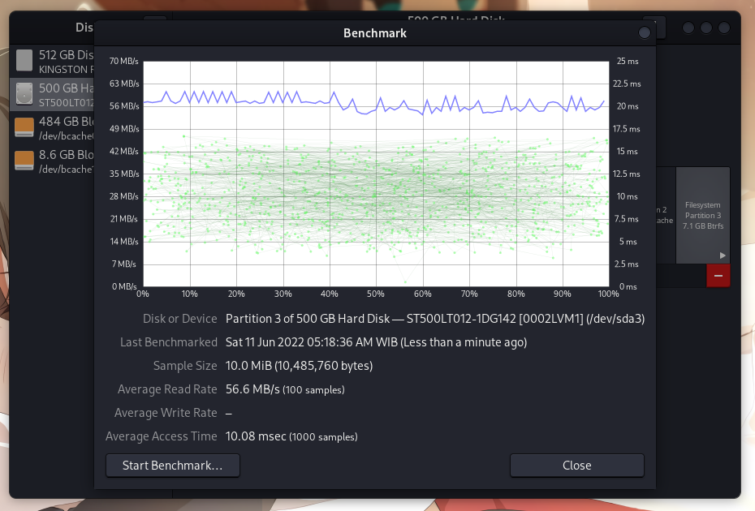
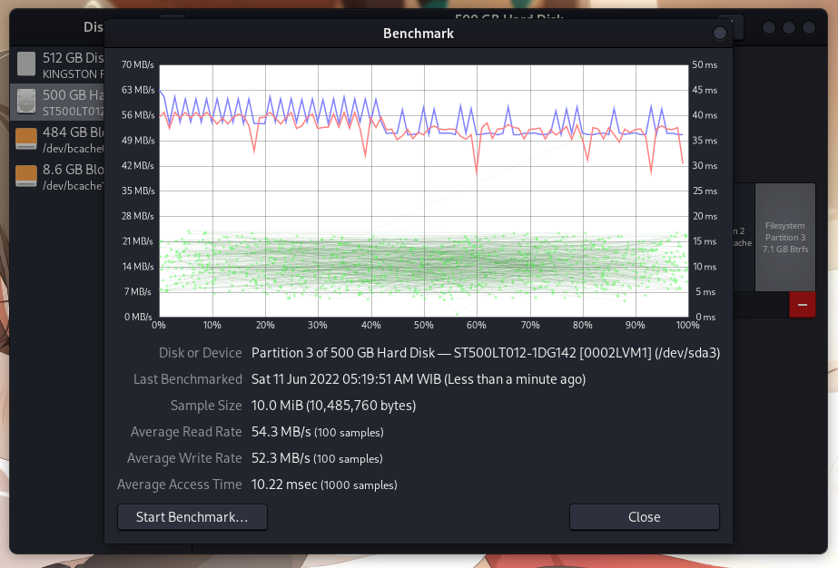
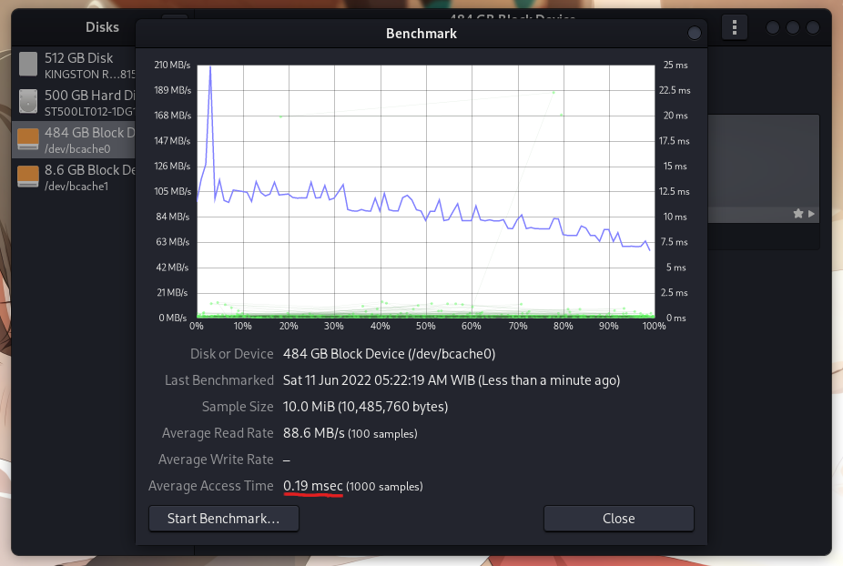
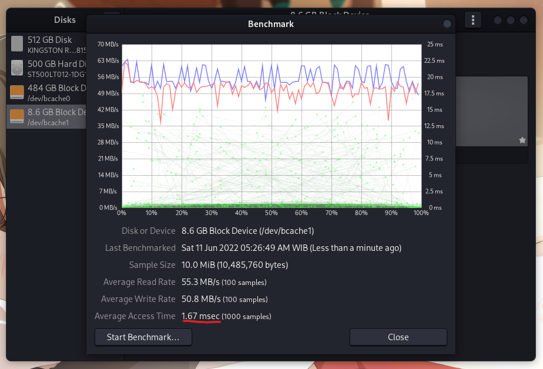
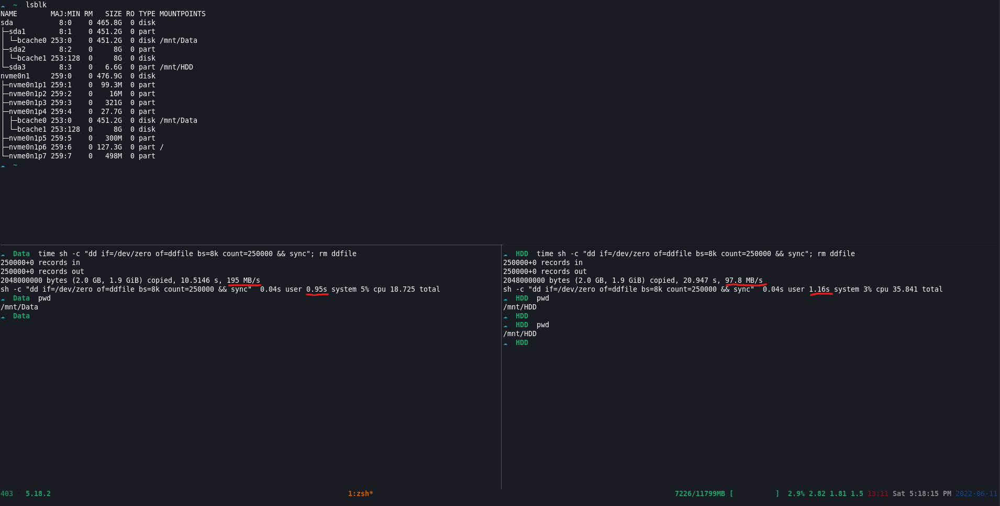

A block layer cache aka Bcache is a tools to create layer cache on storage layer,yes it was cache layer on storage, then how is work?

The workflows are quite simple you just need one partition or disk of ssd/nvme to reformat it and make that disk into caching disk, in my case I use 1 disk caching for 2 partition 

```
☁  ~  lsblk 
NAME        MAJ:MIN RM   SIZE RO TYPE MOUNTPOINTS
sda           8:0    0 465.8G  0 disk 
├─sda1        8:1    0 451.2G  0 part 
│ └─bcache0 253:0    0 451.2G  0 disk /mnt/Data
└─sda2        8:2    0     8G  0 part 
  └─bcache1 253:128  0     8G  0 disk [SWAP]
nvme0n1     259:0    0 476.9G  0 disk 
├─nvme0n1p1 259:1    0  99.3M  0 part 
├─nvme0n1p2 259:2    0    16M  0 part 
├─nvme0n1p3 259:3    0   321G  0 part 
├─nvme0n1p4 259:4    0  27.7G  0 part 
│ ├─bcache0 253:0    0 451.2G  0 disk /mnt/Data
│ └─bcache1 253:128  0     8G  0 disk [SWAP]
├─nvme0n1p5 259:5    0   300M  0 part 
├─nvme0n1p6 259:6    0 127.3G  0 part /
└─nvme0n1p7 259:7    0   498M  0 part 
```
yeah i know,this is was not best practice and safe way to implement bcache but since it's just my personal laptop so i don't really care about data lossing in bcache

Oops did i mention `data lossing`?  
yeah bcache can make your data be gone or you data moved into black hole,bcache can make you data lost forever if you use `writeback` mode in you bcache config. for more detail you can read in [arch wiki](https://wiki.archlinux.org/title/bcache)

### Performance Comparison
First let try to run read only banckmark on hdd regular disk

  

Then try read and write on hdd regular disk

  

And then we test on bcache

Read only with cache

  

Read and Write with cache

  

the Average RW both was almost same but if you see the `Average Access Time` the bcache have 9x lower rather than HDD

if i tested with dd the bcache device the result was increasing 9x and the I/O operation time is decreasing 2x in bcache

  
