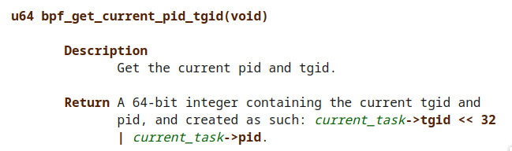

hello folks, finally i have motivation to write a post again (yay) after a loooong time have identity crisis.

ok back to topic in this post i will write about ebpf or extended Berkeley Packet Filter, ebpf was pretty hot for past 2-3 years especially in mesh service world but today ebpf not only appled in mesh service but already implemented in security too.

One of successful product of ebps is cilium, many people use that and do the benchmark and belive if cilium really improving thier peformance but not many people understand the black magic of cilium

## Intro
eBPF technology acctualy pretty old and already exists long time ago, the original of eBPF is Berkeley Packet Filter or originaly for [packet filtering](https://www.tcpdump.org/papers/bpf-usenix93.pdf) (tcpdump), now we back to the basic.

Some of you already familiar with tcpdump right? but how tcpdump work? how tcpdump can capture a network in linux with some filter from user space?  
In example if you add iptables rule to drop icmp in your linux the tcpdump still can capture it right? so that mean tcpdump was working on kernel layer, but another question is how tcpdump can filter it? if you already expriance with kernel module in linux you should know if you cannot make change easly on kernel space or in another way is copying all packet from kernel space then filter it on user space but that will the peformance captureing drop, then how tcpdump solve this issues?

And the answer is ....


Tcpdump create a sandboxed virtual machine in kernel so what ever change in user space the kernel space can easly change it (i would recommend you to read full of [packet filtering](https://www.tcpdump.org/papers/bpf-usenix93.pdf))

We already get the core of black magic bpf, now just image the sandboxed virtual machine not for filtering packet but for syscall,hardware,event,etc  
In sort, if you a programmer or have expriance with programming ebpf is just like javascript in browser.

Since it running on top of sandboxed virtual machine in kernel ofcourse there a verification layer who check the code so the ebpf not breaking the kernel.

eBPF programm it's self running on two space,one is on user-space and another in kernel-space

## Build ebpf code

to build ebpf code you can use [bcc](https://github.com/iovisor/bcc) or [bpftrace](https://github.com/iovisor/bpftrace) those tools i very recommend to try for learning since they already implement CO-RE (Compile Once - Run Everywhere), yes ebpf was very depend on kernel version so if you compile ebpf code on kernel A then run it in kernel B it's would be a problem.

but for this post i will not using those tools, well, understanding the structures will make better understanding.


for this post i will use [libbpf-bootstrap](https://github.com/libbpf/libbpf-bootstrap)


- Install Clang
```
wget https://apt.llvm.org/llvm.sh
chmod +x llvm.sh
sudo ./llvm.sh 15
```

- libbpf & bpftrace
```
sudo apt install libelf-dev bpftrace libbpf-dev
```

- minimal libbpf-bootstrap
```
git clone https://github.com/libbpf/libbpf-bootstrap.git
cd libbpf-bootstrap
git submodule update --init --recursive
cd examples/c/
nano ../../bpftool/src/Makefile.include #LLVM_VERSION ?= 15 # Change the clang to 15
nano Makefile # APPS = minimal
make
sudo ./minimal
```

On another terminal 
```
sudo cat /sys/kernel/debug/tracing/trace_pipe
```

the output should printing `minimal-X  [000] d..31 293068.171061: bpf_trace_printk: BPF triggered from PID X.`

now let's try to read the ebpf code.

##### minimal.bpf.c

```c
// SPDX-License-Identifier: GPL-2.0 OR BSD-3-Clause
/* Copyright (c) 2020 Facebook */
#include <linux/bpf.h>
#include <bpf/bpf_helpers.h>

char LICENSE[] SEC("license") = "Dual BSD/GPL";

int my_pid = 0;

SEC("tp/syscalls/sys_enter_write")
int handle_tp(void *ctx)
{
        int pid = bpf_get_current_pid_tgid() >> 32;

        if (pid != my_pid)
                return 0;

        bpf_printk("BPF triggered from PID %d.\n", pid);

        return 0;
}
```

```c
// SPDX-License-Identifier: GPL-2.0 OR BSD-3-Clause
/* Copyright (c) 2020 Facebook */
#include <linux/bpf.h>
#include <bpf/bpf_helpers.h>

char LICENSE[] SEC("license") = "Dual BSD/GPL";
```
3 code on top was only importing and declare the license,nothing special 

```c
int my_pid
```
was global variable who will contain pid of ebpf app.

```c
SEC("tp/syscalls/sys_enter_write")
``` 
function it's self is like [1]attaching/selecting types where relevant and the ELF section names supported by libbpf


```c
int pid = bpf_get_current_pid_tgid() >> 32;
``` 
the variable `pid` will contain of [2]current event pid and tgid 



and the last is if else conditional, if the current event pid was not same with my_pid variable the ebpf will return 0 which is the ebpf will not print the `BPF triggered from PID bla bla bla`

```c
if (pid != my_pid)
        return 0;

bpf_printk("BPF triggered from PID %d.\n", pid);
```

now the question is how variable `my_pid` was filled with value right? for that we need to read the user space app which is `minimal.c`


##### minimal.c

```c
// SPDX-License-Identifier: (LGPL-2.1 OR BSD-2-Clause)
/* Copyright (c) 2020 Facebook */
#include <stdio.h>
#include <unistd.h>
#include <sys/resource.h>
#include <bpf/libbpf.h>
#include "minimal.skel.h"

static int libbpf_print_fn(enum libbpf_print_level level, const char *format, va_list args)
{
        return vfprintf(stderr, format, args);
}

int main(int argc, char **argv)
{
        struct minimal_bpf *skel;
        int err;

        /* Set up libbpf errors and debug info callback */
        libbpf_set_print(libbpf_print_fn);

        /* Open BPF application */
        skel = minimal_bpf__open();
        if (!skel) {
                fprintf(stderr, "Failed to open BPF skeleton\n");
                return 1;
        }

        /* ensure BPF program only handles write() syscalls from our process */
        skel->bss->my_pid = getpid();

        /* Load & verify BPF programs */
        err = minimal_bpf__load(skel);
        if (err) {
                fprintf(stderr, "Failed to load and verify BPF skeleton\n");
                goto cleanup;
        }

        /* Attach tracepoint handler */
        err = minimal_bpf__attach(skel);
        if (err) {
                fprintf(stderr, "Failed to attach BPF skeleton\n");
                goto cleanup;
        }

        printf("Successfully started! Please run `sudo cat /sys/kernel/debug/tracing/trace_pipe` "
               "to see output of the BPF programs.\n");

        for (;;) {
                /* trigger our BPF program */
                fprintf(stderr, ".");
                sleep(1);
        }

cleanup:
        minimal_bpf__destroy(skel);
        return -err;
}
```

the code was more longer than the kernel space, but i will try to break down it 

```c
// SPDX-License-Identifier: (LGPL-2.1 OR BSD-2-Clause)
/* Copyright (c) 2020 Facebook */
#include <stdio.h>
#include <unistd.h>
#include <sys/resource.h>
#include <bpf/libbpf.h>
#include "minimal.skel.h"

static int libbpf_print_fn(enum libbpf_print_level level, const char *format, va_list args)
{
        return vfprintf(stderr, format, args);
}
```
in this line nothing special,only importing lib

```c
struct minimal_bpf *skel;
int err;
```
first thing is declare create a struct from minimal_bpf and name it 

```c
cskel
```
(skel is acronym for skeleton)


```c
libbpf_set_print(libbpf_print_fn);
``` 
this only Set up libbpf errors and debug info callback

```
skel = minimal_bpf__open();
``` 
now we use skel variable to open minimal.bpf.c code

```c
skel->bss->my_pid = getpid();
``` 
on here we fill the `my_pid` variable from kernel space with `getpid()` function, so the `my_pid` variable will filled with pid from user space app pid


```c
err = minimal_bpf__load(skel);
``` 
now Load & verify BPF programs


```c
err = minimal_bpf__attach(skel);
``` 
attach tracepoint handler

and the last part is

```c
for (;;) {
        /* trigger our BPF program */
        fprintf(stderr, ".");
        sleep(1);
}
```
looping the process and printing , with `fprintf` func


From here we already got where the variable `my_pid` was filled, but there are still another question, why the `cat /sys/kernel/debug/tracing/trace_pipe` keep printing `minimal-X  [000] d..31 293068.171061: bpf_trace_printk: BPF triggered from PID X.` right?

now let we create a simple C to print a string

```c
#include <stdio.h>

int main(int argc, char **argv) {
        fprintf(stderr, "Kano\n");
}
```

compile&run it 
```
gcc kano.c -o kano
./kano
Kano
```
the output will printing "Kano" string, now let's strace it

```bash
execve("./kano", ["./kano"], 0x7ffe1e12af78 /* 28 vars */) = 0
brk(NULL)                               = 0x5559f6a17000
arch_prctl(0x3001 /* ARCH_??? */, 0x7fff0415df50) = -1 EINVAL (Invalid argument)
access("/etc/ld.so.preload", R_OK)      = -1 ENOENT (No such file or directory)
openat(AT_FDCWD, "/etc/ld.so.cache", O_RDONLY|O_CLOEXEC) = 3
fstat(3, {st_mode=S_IFREG|0644, st_size=58697, ...}) = 0
mmap(NULL, 58697, PROT_READ, MAP_PRIVATE, 3, 0) = 0x7f77a1824000
close(3)                                = 0
openat(AT_FDCWD, "/lib/x86_64-linux-gnu/libc.so.6", O_RDONLY|O_CLOEXEC) = 3
read(3, "\177ELF\2\1\1\3\0\0\0\0\0\0\0\0\3\0>\0\1\0\0\0\300A\2\0\0\0\0\0"..., 832) = 832
pread64(3, "\6\0\0\0\4\0\0\0@\0\0\0\0\0\0\0@\0\0\0\0\0\0\0@\0\0\0\0\0\0\0"..., 784, 64) = 784
pread64(3, "\4\0\0\0\20\0\0\0\5\0\0\0GNU\0\2\0\0\300\4\0\0\0\3\0\0\0\0\0\0\0", 32, 848) = 32
pread64(3, "\4\0\0\0\24\0\0\0\3\0\0\0GNU\0\30x\346\264ur\f|Q\226\236i\253-'o"..., 68, 880) = 68
fstat(3, {st_mode=S_IFREG|0755, st_size=2029592, ...}) = 0
mmap(NULL, 8192, PROT_READ|PROT_WRITE, MAP_PRIVATE|MAP_ANONYMOUS, -1, 0) = 0x7f77a1822000
pread64(3, "\6\0\0\0\4\0\0\0@\0\0\0\0\0\0\0@\0\0\0\0\0\0\0@\0\0\0\0\0\0\0"..., 784, 64) = 784
pread64(3, "\4\0\0\0\20\0\0\0\5\0\0\0GNU\0\2\0\0\300\4\0\0\0\3\0\0\0\0\0\0\0", 32, 848) = 32
pread64(3, "\4\0\0\0\24\0\0\0\3\0\0\0GNU\0\30x\346\264ur\f|Q\226\236i\253-'o"..., 68, 880) = 68
mmap(NULL, 2037344, PROT_READ, MAP_PRIVATE|MAP_DENYWRITE, 3, 0) = 0x7f77a1630000
mmap(0x7f77a1652000, 1540096, PROT_READ|PROT_EXEC, MAP_PRIVATE|MAP_FIXED|MAP_DENYWRITE, 3, 0x22000) = 0x7f77a1652000
mmap(0x7f77a17ca000, 319488, PROT_READ, MAP_PRIVATE|MAP_FIXED|MAP_DENYWRITE, 3, 0x19a000) = 0x7f77a17ca000
mmap(0x7f77a1818000, 24576, PROT_READ|PROT_WRITE, MAP_PRIVATE|MAP_FIXED|MAP_DENYWRITE, 3, 0x1e7000) = 0x7f77a1818000
mmap(0x7f77a181e000, 13920, PROT_READ|PROT_WRITE, MAP_PRIVATE|MAP_FIXED|MAP_ANONYMOUS, -1, 0) = 0x7f77a181e000
close(3)                                = 0
arch_prctl(ARCH_SET_FS, 0x7f77a1823540) = 0
mprotect(0x7f77a1818000, 16384, PROT_READ) = 0
mprotect(0x5559f5f87000, 4096, PROT_READ) = 0
mprotect(0x7f77a1860000, 4096, PROT_READ) = 0
munmap(0x7f77a1824000, 58697)           = 0
write(2, "Kano\n", 5Kano
)                   = 5
exit_group(0)                           = ?
+++ exited with 0 +++
```
did you realize it?

yup,the `fprintf` function is calling `write` syscall and that why the tracing output always showing.

------------------------------------
I think it's enough for now, in next part i will write about how we use `SEC`

### Reference
- [1] https://docs.kernel.org/bpf/libbpf/program_types.html
- [2] https://man7.org/linux/man-pages/man7/bpf-helpers.7.html