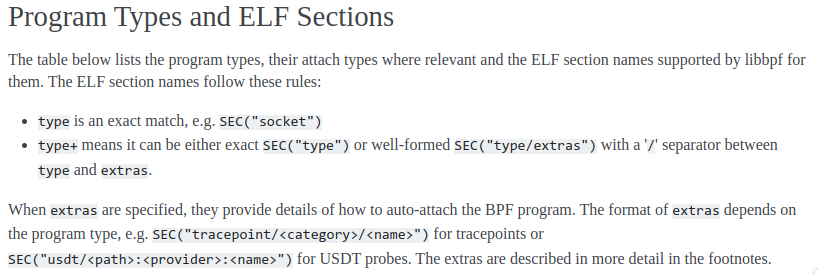
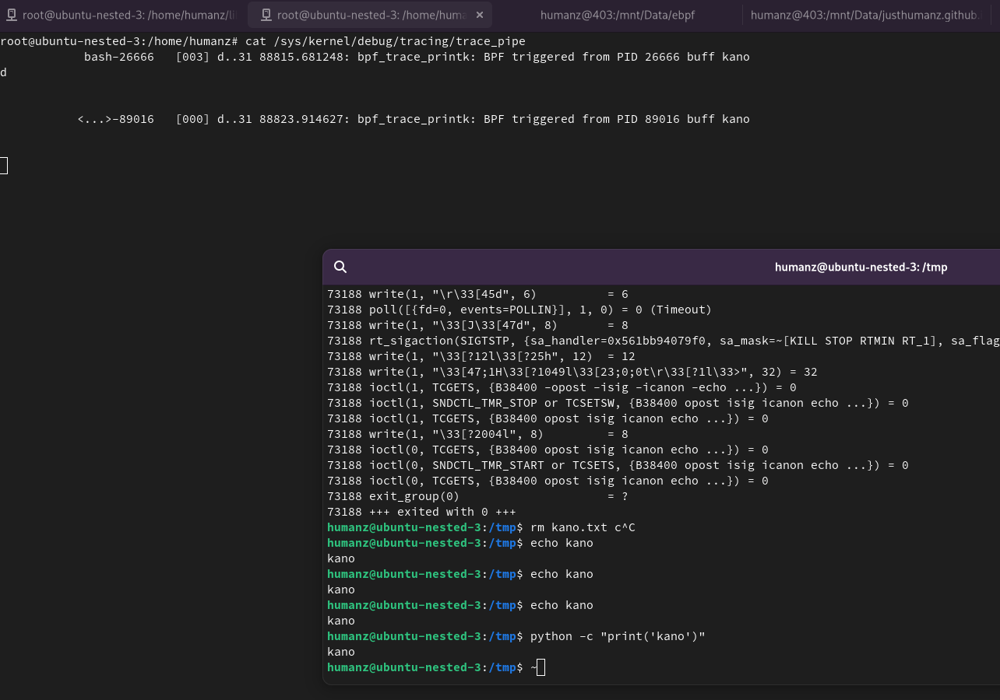

hello folks, welcome back to my blog.

this is was part two from my previous post if you have't read it pls read it first, In this part i will focust on how to using `SEC` or more like how we can use `SEC` func in ebpf code,just like i metion the previous post the `SEC` fuction it's self is like attaching/selecting types where relevant and the ELF section names supported by libbpf[1]




but now the question is, how we get the parameter `"tp/syscalls/sys_enter_write"` and what we can use from that syscalls.


## bpftrace

here the desc from man page

```
bpftrace is a high-level tracing language for Linux enhanced Berkeley Packet Filter (eBPF) available in recent Linux kernels (4.x).

bpftrace uses:
•   LLVM as a backend to compile scripts to BPF-bytecode
•   BCC for interacting with the Linux BPF system
```

the intresting things is 
```
The bpftrace language is inspired by awk and C, and predecessor tracers such as DTrace and SystemTap.

See EXAMPLES and ONELINERS if you are impatient.
See PROBE TYPES and BUILTINS (variables/functions) for the bpftrace language elements.
```
So yeah you can create ebpf with bpftrace scripting whitout coding any c level.

we already install it on previous post so now just let use it

```bash
root@ubuntu-nested-3:/home/humanz/libbpf-bootstrap/examples/c# bpftrace -l *sys_enter_write*
tracepoint:syscalls:sys_enter_write
tracepoint:syscalls:sys_enter_writev
```

As you can see the output was two `tracepoint:syscalls:sys_enter_write` and `tracepoint:syscalls:sys_enter_writev` now we will focust on `tracepoint:syscalls:sys_enter_write`.

Now we can see in detail what is `tracepoint:syscalls:sys_enter_write` 
```bash
root@ubuntu-nested-3:/home/humanz/libbpf-bootstrap/examples/c# bpftrace -lv tracepoint:syscalls:sys_enter_write
tracepoint:syscalls:sys_enter_write
    int __syscall_nr;
    unsigned int fd;
    const char * buf;
    size_t count;
```
the output was have 4 paramater, let's break it one by one,  
```c
int __syscall_nr;
```
this parameter contain the len of argument of syscall function

```
unsigned int fd;
const char * buf;
size_t count;
```
If you already familiar with c code especially in linux dev this all 3 paramter was belong to `write()` function[2].

Now let's start code

#### trace_write.bpf.c
```c
#include "vmlinux.h"
#include <bpf/bpf_helpers.h>

char LICENSE[] SEC("license") = "Dual BSD/GPL";

int uid_inpt;
int fd_inpt;
int len_inpt;

SEC("tp/syscalls/sys_enter_write")
int handle_write(struct trace_event_raw_sys_enter *ctx) {
    int uid = bpf_get_current_uid_gid() >> 32;
    int pid = bpf_get_current_pid_tgid() >> 32;
    if (uid != uid_inpt)
            return 0;

    char *write_str = (char *)ctx->args[1];
    int fd = ctx->args[0];
    int len = ctx->args[2];
    if (fd == fd_inpt && len == len_inpt) {
        bpf_printk("BPF triggered from PID %d buff %s\n", pid,write_str);
    }

    return 0;
}
```

#### trace_write.c
```c
#include <stdio.h>
#include <unistd.h>
#include <sys/resource.h>
#include <bpf/libbpf.h>
#include "trace_write.skel.h"

static int libbpf_print_fn(enum libbpf_print_level level, const char *format, va_list args)
{
	return vfprintf(stderr, format, args);
}

int main(int argc, char **argv)
{
	struct trace_write_bpf *skel;
	int err;

	/* Set up libbpf errors and debug info callback */
	libbpf_set_print(libbpf_print_fn);

	/* Open BPF application */
	skel = trace_write_bpf__open();
	if (!skel) {
		fprintf(stderr, "Failed to open BPF skeleton\n");
		return 1;
	}

	/* ensure BPF program only handles write() syscalls from our process */
	skel->bss->uid_inpt = 1000;
	skel->bss->fd_inpt = 1;
	skel->bss->len_inpt = 5;

	/* Load & verify BPF programs */
	err = trace_write_bpf__load(skel);
	if (err) {
		fprintf(stderr, "Failed to load and verify BPF skeleton\n");
		goto cleanup;
	}

	/* Attach tracepoint handler */
	err = trace_write_bpf__attach(skel);
	if (err) {
		fprintf(stderr, "Failed to attach BPF skeleton\n");
		goto cleanup;
	}

	printf("Successfully started! Please run `sudo cat /sys/kernel/debug/tracing/trace_pipe` "
	       "to see output of the BPF programs.\n");

	for (;;) {
		/* trigger our BPF program */
		fprintf(stderr, ".");
		sleep(1);
	}

cleanup:
	trace_write_bpf__destroy(skel);
	return -err;
}
```

lets break down one by one.

```c
#include "vmlinux.h"
#include <bpf/bpf_helpers.h>

char LICENSE[] SEC("license") = "Dual BSD/GPL";
```
in this we now use `vmlinux.h` header file, which includes all the types from the Linux kernel in one file. It comes pre-generated with libbpf-bootstrap

```c
int uid_inpt;
int fd_inpt;
int len_inpt;
```
same like before,this variable will filled from user-space

```c
SEC("tp/syscalls/sys_enter_write")
int handle_write(struct trace_event_raw_sys_enter *ctx) {
}
```
declarating if we will trace `sys_enter_write`

```c
int uid = bpf_get_current_uid_gid() >> 32;
int pid = bpf_get_current_pid_tgid() >> 32;
if (uid != uid_inpt)
        return 0;

```
the variable `pid` will contain of current event pid[3] and tgid and `uid` for user id and group id[4]


```c
char *write_str = (char *)ctx->args[1];
int fd = ctx->args[0];
int len = ctx->args[2];
```
As output from `bpftrace` the `sys_enter_write` have 3 parameter and let's assign that 3 parm into variable

```c
if (fd == fd_inpt && len == len_inpt) {
    bpf_printk("BPF triggered from PID %d buff %s\n", pid,write_str);
}
```
and the last is if else condition so not all `write` func operation will printed

```c
skel->bss->uid_inpt = 1000;
skel->bss->fd_inpt = 1;
skel->bss->len_inpt = 5;
```
here was we filled the variable from user-space to kernel-space and the input was very simple 
- `uid_inpt = 1000` ebpf only trace user with id 1000
- `fd = 1` File descriptor 1, so we only trace `stdout`[5]
- `buff = 5` the len of write buffer should be 5 (including newline `\n`)

Now let's run it.

```
nano Makefile #APPS = trace_write 
make
./trace_write #open /sys/kernel/debug/tracing/trace_pipe on another terminal
echo kano # see the trace_pipe
```



As you can see when we user `echo` or even `python` to print "kano" string the ebpf will triggerd 

### Reference
- [1] https://docs.kernel.org/bpf/libbpf/program_types.html
- [2] https://man7.org/linux/man-pages/man2/write.2.html
- [3] https://github.com/iovisor/bcc/blob/master/docs/reference_guide.md#4-bpf_get_current_pid_tgid
- [4] https://github.com/iovisor/bcc/blob/master/docs/reference_guide.md#5-bpf_get_current_uid_gid
- [5] https://en.wikipedia.org/wiki/File_descriptor
