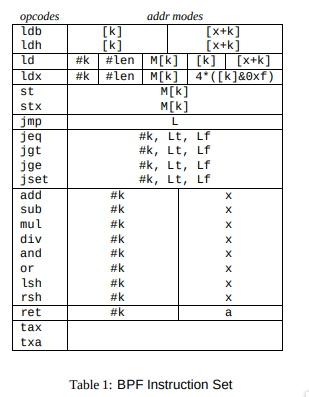
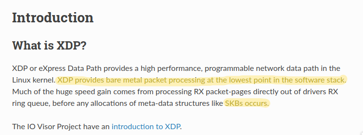
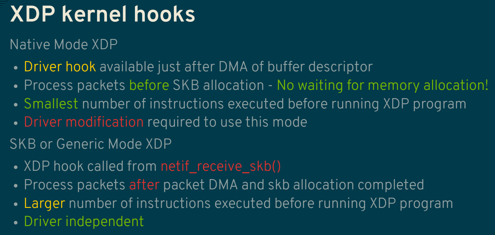

This is was part three or maybe will be last part of eBPF topic in my blog, on this i will talk about XDP or eXpress Data Path and Traffic Controll, well yeah many people know or see how powerfull eBPF on networking level since the popular product of eBPF is calium who made significant improve on mesh service.

Before we start how ebpf works on level network, it would be better if we understand how linux handle network first

<details>
  <summary>Important Rule</summary>
  Let's pretend where we don't have hundred or thousand of cpu/ram
  
  

</details>

## Linux Networking Stack


NO, NO NO NO i don't want to explain it to you, you can read it by your self on this [book](https://www.beej.us/guide/bgnet/html/split/), understanding about linux networking stack can be crucial for this topic 

## Linux Packet Filtering
Since we talk about eBPF who designed for filtering package so we need to understand how linux filtering packet at first place.

Let's start with the tools who loved from networking guy until the 'fancy latest' devops guy, yep tcpdump.
wait you already read the [packet filtering](https://www.tcpdump.org/papers/bpf-usenix93.pdf) paper did you? read it please, minimum you can read it until **The Filter Model** i'm begging to you 🥺🥺🥺

if you already read it and still don't understand or kinda confused let me make it more simple

##### Packet Filtering without bpf
```
root@ubuntu-nested-3:~# tcpdump -i enp1s0 -A | grep ICMP
tcpdump: verbose output suppressed, use -v or -vv for full protocol decode
listening on enp1s0, link-type EN10MB (Ethernet), capture size 262144 bytes
16:54:27.023763 IP ubuntu-nested-5 > ubuntu-nested-3: ICMP echo request, id 5191, seq 1107, length 64
16:54:27.023806 IP ubuntu-nested-3 > ubuntu-nested-5: ICMP echo reply, id 5191, seq 1107, length 64
16:54:28.025011 IP ubuntu-nested-5 > ubuntu-nested-3: ICMP echo request, id 5191, seq 1108, length 64
16:54:28.025087 IP ubuntu-nested-3 > ubuntu-nested-5: ICMP echo reply, id 5191, seq 1108, length 64
16:54:29.026170 IP ubuntu-nested-5 > ubuntu-nested-3: ICMP echo request, id 5191, seq 1109, length 64
16:54:29.026234 IP ubuntu-nested-3 > ubuntu-nested-5: ICMP echo reply, id 5191, seq 1109, length 64
16:54:30.027435 IP ubuntu-nested-5 > ubuntu-nested-3: ICMP echo request, id 5191, seq 1110, length 64
16:54:30.027519 IP ubuntu-nested-3 > ubuntu-nested-5: ICMP echo reply, id 5191, seq 1110, length 64
16:54:31.028617 IP ubuntu-nested-5 > ubuntu-nested-3: ICMP echo request, id 5191, seq 1111, length 64
16:54:31.028675 IP ubuntu-nested-3 > ubuntu-nested-5: ICMP echo reply, id 5191, seq 1111, length 64
16:54:32.029780 IP ubuntu-nested-5 > ubuntu-nested-3: ICMP echo request, id 5191, seq 1112, length 64
16:54:32.029847 IP ubuntu-nested-3 > ubuntu-nested-5: ICMP echo reply, id 5191, seq 1112, length 64
52 packets captured
58 packets received by filter
0 packets dropped by kernel
```

##### Packet Filtering with bpf
```
root@ubuntu-nested-3:~# tcpdump -i enp1s0 icmp
tcpdump: verbose output suppressed, use -v or -vv for full protocol decode
listening on enp1s0, link-type EN10MB (Ethernet), capture size 262144 bytes
16:54:56.058354 IP ubuntu-nested-5 > ubuntu-nested-3: ICMP echo request, id 5191, seq 1136, length 64
16:54:56.058440 IP ubuntu-nested-3 > ubuntu-nested-5: ICMP echo reply, id 5191, seq 1136, length 64
16:54:57.059490 IP ubuntu-nested-5 > ubuntu-nested-3: ICMP echo request, id 5191, seq 1137, length 64
16:54:57.059562 IP ubuntu-nested-3 > ubuntu-nested-5: ICMP echo reply, id 5191, seq 1137, length 64
16:54:58.060677 IP ubuntu-nested-5 > ubuntu-nested-3: ICMP echo request, id 5191, seq 1138, length 64
16:54:58.060747 IP ubuntu-nested-3 > ubuntu-nested-5: ICMP echo reply, id 5191, seq 1138, length 64
16:54:59.061810 IP ubuntu-nested-5 > ubuntu-nested-3: ICMP echo request, id 5191, seq 1139, length 64
16:54:59.061882 IP ubuntu-nested-3 > ubuntu-nested-5: ICMP echo reply, id 5191, seq 1139, length 64
16:55:00.062957 IP ubuntu-nested-5 > ubuntu-nested-3: ICMP echo request, id 5191, seq 1140, length 64
16:55:00.063018 IP ubuntu-nested-3 > ubuntu-nested-5: ICMP echo reply, id 5191, seq 1140, length 64
16:55:01.064103 IP ubuntu-nested-5 > ubuntu-nested-3: ICMP echo request, id 5191, seq 1141, length 64
16:55:01.064168 IP ubuntu-nested-3 > ubuntu-nested-5: ICMP echo reply, id 5191, seq 1141, length 64
16:55:02.065320 IP ubuntu-nested-5 > ubuntu-nested-3: ICMP echo request, id 5191, seq 1142, length 64
16:55:02.065399 IP ubuntu-nested-3 > ubuntu-nested-5: ICMP echo reply, id 5191, seq 1142, length 64
16:55:03.066484 IP ubuntu-nested-5 > ubuntu-nested-3: ICMP echo request, id 5191, seq 1143, length 64
16:55:03.066552 IP ubuntu-nested-3 > ubuntu-nested-5: ICMP echo reply, id 5191, seq 1143, length 64
16 packets captured
16 packets received by filter
0 packets dropped by kernel
```


From those command the output was smillar but the process was very diffrent, well maybe you already guess it.


Yep the resource, filtering package with bpf will more efficient rather than whitout bpf, why? well because bpf was designed to filtering the package 'on the place' meanwhile when use `grab` the buffer from kernel space will copyed into user space then filter it and that make the filtering more hungry with resource.

But wait, if you ever already have experience with linux kernel stuff you should understand/know if linux kernel stuff was not dynamic like in user space,kernel space have more strict (u can nuke ur system if you made a mistake) rule and you cannot change anything easily then how they filtering the package on kernel level since changing is hard?

Once again, if you already read the full paper you should know it.


They create a **bytecode virtual machine(register-based virtual machine) in kernel** and yes they create the cpu Instructions



This is why tcpdump can have dynamic filtering package on kernel level, because they create their own cpu Instructions, here the example

if we trying to filter tcp package we just use `tcpdump tcp` but it will translated into bpf cpu Instructions then executed inside of kernel

```bash
root@ubuntu-nested-3:~# tcpdump -d tcp
(000) ldh      [12]
(001) jeq      #0x86dd          jt 2    jf 7
(002) ldb      [20]
(003) jeq      #0x6             jt 10   jf 4
(004) jeq      #0x2c            jt 5    jf 11
(005) ldb      [54]
(006) jeq      #0x6             jt 10   jf 11
(007) jeq      #0x800           jt 8    jf 11
(008) ldb      [23]
(009) jeq      #0x6             jt 10   jf 11
(010) ret      #262144
(011) ret      #0
```

or you can generate the array bytecode 
```bash
root@ubuntu-nested-3:~# tcpdump -dd tcp
{ 0x28, 0, 0, 0x0000000c },
{ 0x15, 0, 5, 0x000086dd },
{ 0x30, 0, 0, 0x00000014 },
{ 0x15, 6, 0, 0x00000006 },
{ 0x15, 0, 6, 0x0000002c },
{ 0x30, 0, 0, 0x00000036 },
{ 0x15, 3, 4, 0x00000006 },
{ 0x15, 0, 3, 0x00000800 },
{ 0x30, 0, 0, 0x00000017 },
{ 0x15, 0, 1, 0x00000006 },
{ 0x6, 0, 0, 0x00040000 },
{ 0x6, 0, 0, 0x00000000 },
```

this all make sense why tcpdump was very efficient to filtering network package

## XDP&TC


##### Today
*today most of server can have hundred or even thousand core/memory, so where the problem?*


yes, **servers nowday can have powerfull resource** but remember one thing **our client can have it too** not only client with hungry request but the count of client can double, remember if nowday many product of `smart` device? yep that our client too or even your toaster can send a request to server

and from another point is networking nowdays not only for connecting one/more compute/bare metal to another compute/bare, networking nowdays can be happen inside the compute/bare it's self (i.e: container/vm via veth) and that network requer network filtering.

### iptables, our lovely tools 


[*Over the years, iptables has been a blessing and a curse: a blessing for its flexibility and quick fixes. A curse during times debugging a 5K rules iptables setup in an environment where multiple system components are fighting over who gets to install what iptables rules.*](https://cilium.io/blog/2018/04/17/why-is-the-kernel-community-replacing-iptables/)

that make sense since iptables was created 20 years ago and didn't not design it to have thousand rule also iptabels was working with hook method in each tables and what they cost to jump from one tables to another tables? yes cpu time

  
[Nftables - Packet flow and Netfilter hooks in detail](https://thermalcircle.de/doku.php?id=blog:linux:nftables_packet_flow_netfilter_hooks_detail)


and the last is research from [cloudflare](https://cloudflare.com).  
they do [research with filtering package(droping the package)](https://blog.cloudflare.com/how-to-drop-10-million-packets/) and the result

  

xdp won with crazy gap between another package filter.

but once again, why this can be happen? what is XDP make more special than another tools? 

let's read the document(real man always read the document)



the [doc](https://prototype-kernel.readthedocs.io/en/latest/networking/XDP/introduction.html) says if xdp was **processing at lowest point** and it's come before **SKB**  
tl;dr [SKB or socket buffer](http://vger.kernel.org/~davem/skb.html) is the most fundamental data structure in the Linux networking code. Every packet sent or received is handled using this data structure.

but how xdp do this? modify the hw drivers? or the hw need to be special?

*well yes but actually no*   
so xdp have 3 mode, Generic,Native,Offloaded. each mode have different workflows

  
[lpc2018-xdp-tutorial](https://lpc.events/event/2/contributions/71/attachments/17/9/presentation-lpc2018-xdp-tutorial.pdf)

the offloaded is kinda new mode, the offloaded is load&run the bpf program at NIC driver it's self, usualy smartNIC can do this

### Let's code
sorry i talk to much about this one, now let's start the code, in here let's try to create a simple filtering udp pkt with dst port 2525

[Magic C code](https://github.com/JustHumanz/ebpf-dojo/blob/master/xdp/drop_udp.c)

```bash
clang -O2 -target bpf -g -c drop_udp.c -o drop_udp.o
ip link set dev enp3s0 xdpgeneric obj drop_udp.o sec xdp_udp
cat /sys/kernel/debug/tracing/trace_pipe
```

Now let's try with nc

clinet
```bash
╭─[403] as humanz in /mnt/Data/ebpf
╰──➤ nc -w3 -uv 200.0.0.50 2525
ls
id
idd
```

server
```bash
root@ubuntu-nested-5:/home/humanz/xdp_drop# cat /sys/kernel/debug/tracing/trace_pipe
          <idle>-0       [000] ..s21  5752.059568: bpf_trace_printk: Drop udp pkt, src addr 1677721800 dst port 2525

          <idle>-0       [000] ..s21  5752.597395: bpf_trace_printk: Drop udp pkt, src addr 1677721800 dst port 2525

          <idle>-0       [000] ..s21  5753.186206: bpf_trace_printk: Drop udp pkt, src addr 1677721800 dst port 2525
```

as you can see the package was getting dropped, the intreasting is if we dump the network package with tcpdump the trafict isn't showing any udp pkt

clinet
```bash
╭─[403] as humanz in /mnt/Data/ebpf
╰──➤ nc -w3 -uv 200.0.0.50 2525
ls
aa
cc
aa
```

server
```bash
root@ubuntu-nested-5:/home/humanz/xdp_drop# tcpdump -ni enp3s0 udp
tcpdump: verbose output suppressed, use -v or -vv for full protocol decode
listening on enp3s0, link-type EN10MB (Ethernet), capture size 262144 bytes
^C
0 packets captured
0 packets received by filter
0 packets dropped by kernel
```

but since i was using vm so the interface `enp3s0` have vnet pair on my host so let's try dump it too

on my host
```bash
╭─[403] as humanz in ~
╰──➤ sudo virsh dumpxml ubuntu-nested-5 | grep net2 -A3 -B3
    <interface type='network'>
      <mac address='52:54:00:82:45:28'/>
      <source network='internal' portid='d5837615-4a00-4776-beea-af55da9c9156' bridge='virbr2'/>
      <target dev='vnet2'/>
      <model type='virtio'/>
      <alias name='net2'/>
      <address type='pci' domain='0x0000' bus='0x03' slot='0x00' function='0x0'/>
    </interface>
    <serial type='pty'>
```

so the pair if net2 is vnet2, let's dump it 
```bash
╭─[403] as humanz in
╰──➤ sudo tcpdump -ni vnet2 udp
tcpdump: verbose output suppressed, use -v[v]... for full protocol decode
listening on vnet2, link-type EN10MB (Ethernet), snapshot length 262144 bytes
23:59:20.668263 IP 200.0.0.100.53040 > 200.0.0.50.2525: UDP, length 3
23:59:21.636160 IP 200.0.0.100.53040 > 200.0.0.50.2525: UDP, length 3
23:59:22.834528 IP 200.0.0.100.53040 > 200.0.0.50.2525: UDP, length 5
```
And yeah the pkt was appers on the peer interface but not inside the vm and this one is proof if xdp was [**processing at lowest point** and it's come before **SKB**](https://prototype-kernel.readthedocs.io/en/latest/networking/XDP/introduction.html)

Now all was make sense why XDP win with crazy gap between another tools

# TC
TODO