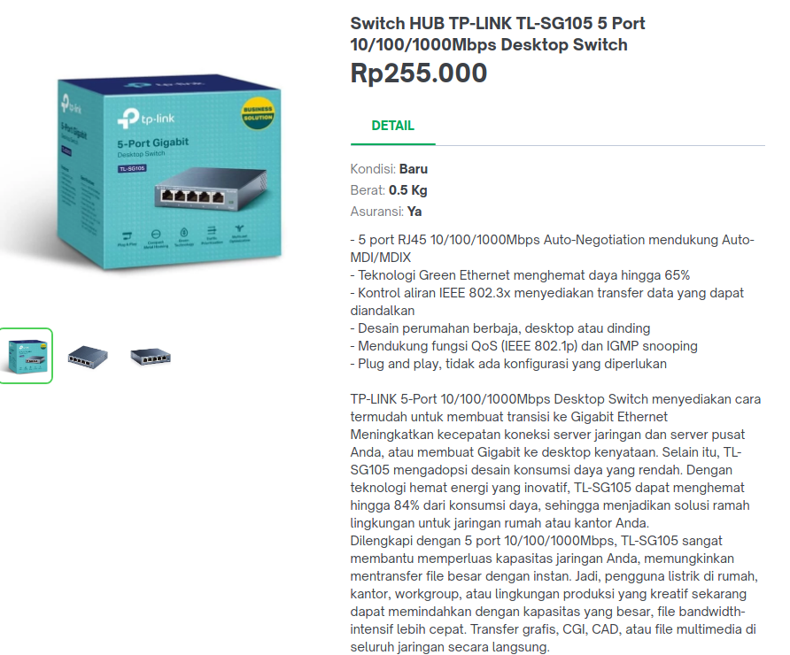

Hello all, it's already long time not write a article. today i'm will talk about my new home server who i built a few days ago  
The reason i build this home server is simple, so currently i have two laptop gaming (one is mine and another is from my office) and one regular laptop and i want to play some game in both laptop but yeahh i was too lazy to copy it and i think it's not efficient since when the game getting updated i need to recopy the update to another laptop.

## Topology
```
       Internet
        xxxxxx
      xx      xx
 xxxxx          xx
 x             xxx
 xx  x          xx
xxx  xxx  xx     x ◄─────┐
x     xx   xx xx x       │
x   xxxx   x    xx       │
xxxx   xx xx             │
        xxx              │
                         │
                         │
                         │
                         │
                         │              ┌────┐
                 ┌───────┴──────┐       │HDD │
                 │172.16.18.1/24│       ├────┘
                 │ Regular      │◄──────┤
                 │ Laptop as    │       ├────┐
                 │ server       │       │HDD │
                 └──────────────┘       └────┘
                         ▲
                         │
                    ┌────┴──┐
           ┌───────►│ Switch│◄────────────┐
           │        └───────┘             │
           │                              │
           │                              │
           │                              │
    ┌──────┴────────┐                ┌────┴───────┐
    │172.16.18.10/24│                │172.16.18.20│
    │Laptop 1       │                │Laptop 2    │
    └───────────────┘                └────────────┘
```


## Hardware




For switch i use TP-LINK TL-SG105 5 Port with 1000Mbps


And since my regular laptop dosen't have ethernet port i need the coverter which is support 1000Mbps and additional usb adapter

## Setup
First i setup nfs server on my regular laptop

- `apt install nfs-server -y`
- `nano /etc/exports`
```
/mnt/Games 172.16.18.0/24(rw,sync,subtree_check,anonuid=1000,anongid=1000) #this will be my gaming data
/mnt/ntfs_disk 172.16.18.0/24(rw,sync,subtree_check) #this will be my disk data
```
- `systemctl enable --now nfs-server`

In my both laptop
- `sudo mount -t nfs 172.16.18.1:/mnt/ntfs_disk/ /mnt/nfs_disk`
- `sudo mount -t nfs 172.16.18.1:/mnt/Games/ /mnt/nfs_game`

And here was the result
```
Filesystem                  Size  Used Avail Use% Mounted on
dev                          12G     0   12G   0% /dev
run                          12G  1.7M   12G   1% /run
efivarfs                    128K   32K   92K  26% /sys/firmware/efi/efivars
/dev/nvme0n1p2              427G  208G  217G  49% /
tmpfs                        12G  1.8G  9.7G  16% /dev/shm
tmpfs                        12G   71M   12G   1% /tmp
/dev/bcache0                450G  366G   84G  82% /mnt/Data
172.16.18.1:/mnt/Games      234G  197G   25G  89% /mnt/nfs_games
tmpfs                       2.3G  104K  2.3G   1% /run/user/1000
172.16.18.1:/mnt/ntfs_disk  916G   11G  859G   2% /mnt/nfs_disk
[403] as humanz ~
'Genshin Impact'   Proton-GE  'Star Rail'   WarThunder

[403] as humanz ~
'$RECYCLE.BIN'   lost+found   Music  'System Volume Information'   Win10_22H2_English_x64v1.iso
```

## Services
Since now i have a computer who run 24/7 i'm thingking like "can i move my s3 data from contabo into this computer? well the data not pretty big and not often accessed by user and it's should be fine"

it's time to move it

- `mcli cp -r humanz-bkt/kano .`

buttttt i just realize if i don't have any ip public, i forget if my provider doesn't serve any public ip into their customer, so i need another plan

#### SSH is only that i need
i got some answer from my problem, some tools/service like ddns or cloudflare tunnel but those tools was need to install some agent into my machine and i didn't want it. and yeah SSH is only the tools what i need

### Service Topology
```bash

   xxxxxx  xxxxxxx                                                                      ┌─────────────────────────────────────┐
  xx     xx      x                                                                      │                                     │
  x             xx                              ┌─────────────────────────┐             │                      ┌────────────┐ │
  xx          xxx                               │                         │             │                      │Filebrowser │ │
   x            xxx x                           │  ┌─────┐                │             │  ┌──────────────┐◄───┴────────────┘ │
  xxx                xx xx──────────────────────┼──┤Nginx│   ┌─────────┐◄─┼─────────────┼──┤ssh_tunnel svc│                   │
 xx                      x                      │  └─────┘   │Localhost│  │             │┌►└──────────────┘◄──┬───────┐       │
 xx  xx             x    x                      │            └─────────┴──┼─────────────┼┘                    │ MinIO │       │
  xxxxx         x   xxxxxx                      │          VPS            │             │                     └───────┘       │
       x       xxx   x                          └─────────────────────────┘             │           My regular laptop         │
        xx    xx x   x                                                                  └─────────────────────────────────────┘
          xx xx  x   x
            xx    x xx
                  xxx
        Internet
```

So here the topology, first i need a VPS for the ip public and after that i create a ssh tunnel service to forward my packet from my local regular laptop to my vps and after that my nginx will handle it with reverse proxy.

In my vps
- `nano /etc/sshd/sshd_config` #Set AllowTcpForwarding yes
- `systemctl relaod sshd`

In my regular laptop
- `nano /etc/systemd/system/tunnel_minio.service`

```
[Unit]
Description=MinIO sshtunnel
After=network.target

[Service]
Restart=always
RestartSec=5
Restart=always
ExecStart=/usr/bin/ssh -NT -o ServerAliveInterval=60 -o StrictHostKeyChecking=no -R 9000:127.0.0.1:9000 tunnel@<IP ADDR>

[Install]
WantedBy=multi-user.target
```

- `nano /etc/systemd/system/tunnel_filebrowser.service`

```
[Unit]
Description=filebrowser sshtunnel
After=network.target

[Service]
Restart=always
RestartSec=5
Restart=always
ExecStart=/usr/bin/ssh -NT -o ServerAliveInterval=60 -o StrictHostKeyChecking=no -R 8000:127.0.0.1:8000 tunnel@<IP ADDR>

[Install]
WantedBy=multi-user.target
```

- `systemctl daemon-reload`
- `systemctl enable --now tunnel_minio.service tunnel_filebrowser.service`

Now let's recheck it on my vps

- `netstat -tulpn | grep sshd`
if there listen port then the tunnel already created


- `apt install openresty`
- `nano /etc/openresty/nginx.conf`
```
    server {
        listen 80;
        server_name *.humanz.moe;
        location / {
                proxy_pass http://localhost:9000;
        }
        return 301 https://$host$request_uri;
    }

    server {
        listen 443 ssl;
        server_name storage.humanz.moe;
        ssl_certificate     /etc/ssl/storage.humanz.moe.cert;
        ssl_certificate_key /etc/ssl/storage.humanz.moe.key;

        location = / {
            default_type text/plain;
            content_by_lua_block {
                ngx.say("Humanz")
            }
        }

        location ~^/ {
                proxy_pass http://localhost:9000;
        }
    }

    .....
    .........
    ...........
```

- `systemctl restart openresty.service`

All config done now i can access my local service from internet with ssh tunnel.


This image was hostinged in my local service

 