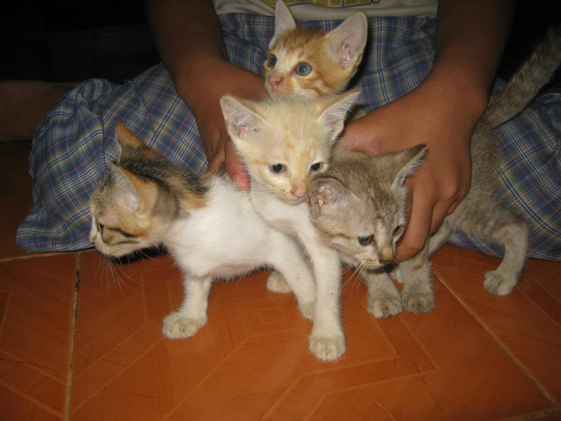
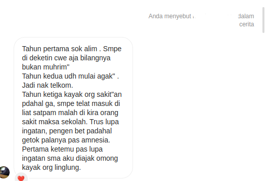
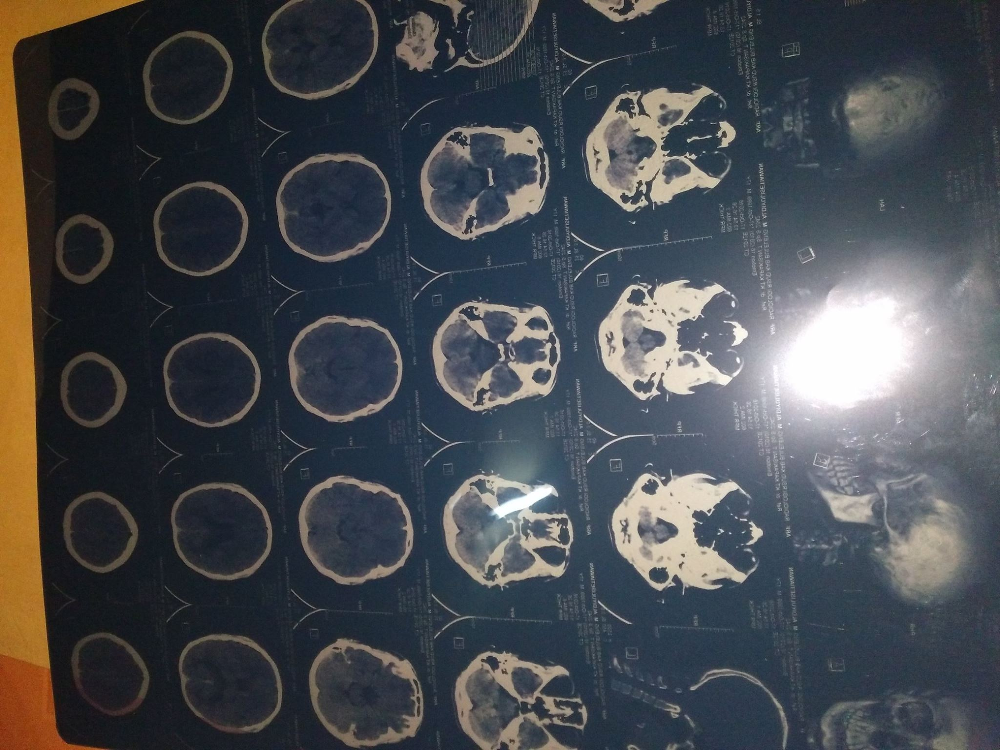

Hi, if you read this that's mean you are my close friend from rl/fb/ig/tw or maybe you just a random person who surfs the internet?  

This time i will not talk about technical stuff, beside i want to write my personal journey of life.  

The motivation behind this was  

First, I don't have many friends to talk to about this (mostly my friend was male and it's little bit weird if i talk about feeling with another male) and second is I hope you, who read this will learn something from my story, I don't want `another` me in next generation

In this story I (who write this) will use third person point of view because I don't really remember some of memory just like fragment of dreams

## Born
He was born in Bali but actually, His race is not Balinese both of his parents was from java they just move to Bali because of job, born in august 1999 with a normal condition (except his ear was asymmetrical) but his mom saying if the give birth process was need a long time and very pain, backthen she said if the process was more than 4 hours, maybe it takes a long time because his mom did not give birth process at hospital but on dukun beranak ? 🤔 well I don't know I never benchmark them 😛

Anyway, He was living in north Bali, the place was not very remote but yeah the access was very minimum and far from the city the closest city is 45km, and need time 2 hours by microbus or 1 hour if you ride a motorcycle. And His village is not like your imagination of 'Balinese village' the village is a Muslim village almost 80% of those who live here was Muslim.

Oh yeah I almost forget to tell you, He is the last child of two brothers He has big sister and the age gap is 6 years and one of my parent was working as a teacher

## Grow

### Elementary School
He spend 2 years on the playground and after that, he was registered at a local Islamic school, here where the ~~h3ll~~ story began.

Fyi in this school they have two class categories, Class A and Class B yep maybe you already guess Class A was full of 'smart' kids and I was in Class A 😗. for the first two years he doesn't have any problems everything ok and running smoothly until on year 3 from here they use the rank system and the teaching material becomes heavier than before, in year 3 He was learning about basic math&language and religion but that was not all because after school He must go to TPA(it's just like the place where the kids learn how to read quran).

1 Semester already passed in year 3, yep it's 'rapotan' time, now guest what's is his rank? 


jeng jeng jeng,rank is .........


25 of 26 students 🫠, he almost failed all subjects at that time, He don't very understand what that all meant so just keep chilling out and playing with his friends, well this is happening not only in school but in TPA too, TPA he was the last person who still can't read the basic of iqro but everything still ok, I still can play with my friend & go to school 'normally'

But from here everyday just make him feel weird, every day he becomes more clumsy, shyer, and more stupid, like when the teacher was dictating then only he who can't follow what is the teacher saying, or when the teacher tells the students to remember multiplication table only he who can't remember at all.  

Because of that all now he was in the bottom tier of the class and when the task is to create a group only he who doesn't have any group or no one wanted to pick him, from here the social class just begun, every kid in class have roles   
Someone who has a big body becomes the natural leader and someone who cheerful kid who is always good for making people laugh or a kid who never listens to whatever teachers saying or the kid who to way smart and the rest is literary npc, yep from all of the roles his role is to become the material to make class laughing, in example some kid will touch&playing with his ear without permission just because his ear was unique or he was write a sentence but typo and other kid found it this kid will tell the whole class if he was a typo and whole class just laugh or when it's 'setoran hafalan' time but only he who still can't remember fully the surah. back then He can't fight back because his body was relatively small and mushy, sometimes he just was crying when they start bullying and that just make the condition more worst because now they mark him as a 'weak kid'

Every day got harder, and now his parent showing/saying disappointment, that happen because some of his classmates were children of his parent friends so yeah if he got a problem or his rank was bad, his parent friends will know about it and it's can become a gossip among the parents. Now both in school and home was very very messy, in school got bullied and in-home got shouted at every day  

In year 4 there is one new subject, this new subject is learning the local language including the local script, and the class was kinda bad luck because his class got an 'angry teacher' for teaching this subject. there's is one moment where he can't remember the script and he was very scared and then decide to go home(this become a big issue in school **skipping class in school at that time was very very taboo**)   

Sometimes he was lying if he was feeling sick and made absent from school. but this lying was too sweet for him and make him addicted, in one moment his total absent in one semester was already 2 weeks. 

In year 5 the condition getting more worst, he got more often bullied, He doesn't understand a single thing when class started (probably because He was too many take absent and skipping many fundamental/basic things) He also get marked as lazy person from teachers+parents, now every night His feeling only have two, scared and worried about tomorrow

Now He become officially neet, He never playing at outside He just play ra2 on intel celeren PC, Sometimes his friends was inviting to playing at outside and yeah He can't refuse it and some of them was a good memory tho (thx for an invite to playing outside with you, it's good memory) Usually if his friends doesn't come He just playing with his cats

     


Fast forward He was graduated from Elementary School now He registering on Tsanawiah school who not far from his house, The bad news is his best friend was going to 'pondok pesantren'

### Middle School
This time it's getting more worst now the teachers also bullying, the reason? ofcourse because He still can't read the quran  
At that time he always getting scared&worried when religion subject was coming, in that subject the students should memorize surah&hadis also reading the quran at front of class and for some reason he always failing when both memorize&reading, yes just like another middle school students they will laugh on you if you failed and some of his mistake will become bullying material. And that was happening over and over 

Can't blame the teachers, they already give him an extra class special for some students like him, but he was always absent on that class  
Well He already trying for coming 2 or 3 times, when the extra class started somehow it's was same, He still don't understand how to remember those symbols and those rules, it's because the method was wrong or he just stupid (?)

There's is one moment when the one elder teacher teaching his class and knowing about if he can't read it, he gets shouted in front of the class, but this time was next level because the teacher says 'are you a devil or what? how cloud you can't read it at this age?' and he just silence, a few days after that some of classmates start sarcasm him with the world 'ofc he can't read it,he was devil lol,bro u need ruqyah to clean up your brain from satan' at that time he only can accept that words, sometimes in his mind think if maybe they was right, because only me have that problem other kids was normal only me who can't read or remember it

At home, he always has dissension with his parent, they always compare his big sister or his cousin who already archive many achievements, He was starting think if he was the biggest failure in his family. Sometimes the parent were saying if they were more glad if He was not their child or not be born(typical asian parenting) those words always come day by day out from his parent, more and more he gets used to that words also they always fight each other, one is defending him and another one is the reverse but that fight will be ended in economy problem (one of them have failing do the role at family structure)

Now he dosen't have any friends + bullied at school + shouted at home, In Elementary School he hate school now he hate life  
From here he was trying to find a way to escape or find a oasis from this life, just like others looser, he was escaping to the internet, gladly on internet he was met with awesome friend & community

Internet just like oasis for him, because in the internet people want to interact with him no matter how weird he is   
Every day the situation just getting worst, In RL he become more more looser but not in internet and because of that he spend more time on internet 

3 years almost passed in this school, Now he should make a choice for the High School since he can't register on closest high school, yep his parent was working as a teacher on closest high school and yes he doesn't want make his parent more embarrassing&stress because of him so he should choice High School far far away until no one know about his past (just like bocchi in btr). then he was thingking "since I was good&like at computer why i don't registering on school where i can learn about computer?" after that he was searching about school like that and he get the info if techinical school have TKJ major who learn about computer&network, but at that time the school who have computer major is only at city.

### High School
This was hard choice but both he and his parent was don't have any other options. After register&test he was accepted on new school from that now he was live alone (yep he already become 'anak kos' at age 15) and far away from his parent.

At fist he was pretty excited with new environment friend, after a month he still trying to adapting with new env, but from here everthing was staring good no more bullying both physical&mental, no more get shouted. more and more everything was ok

But here was the problem, he was don't know how long it's was,because a years after that he got a amnesia and some of memory was lost (not total,but many memory when he was on high school was lost)
 
Here some desc of me when High School from my best friend
     

**From here i will use my point of view because from here i'm still remember clearly what's happening**

Here was my brain scan after amnesia or you can see my post at [fb](https://web.facebook.com/photo/?fbid=1141821915911482&set=a.315671811859834) 
     

honesty have amnesia experiance kinda strange tho, like you just forget the moment but something you already learn still stick on your head and if you meet some people but you already forget it the feels it's like "i think we already meet this guy before,but i don't know where and when, this guy just familiar"

from here this accident was become big news in my school and yes my class was not belive if i had amnesia 😅   

after a few weeks therapy the result was not changed very much and the docter said if i can go to school and i'm already absent for 1 month.  

When i walk in into the class shuddenly the class become silance and i'm just "hehe,so this is my class?" and then go to back and sit when break launch start all of my classmate come to my desk and asking "do you still remember me?, can you guess my name?" and i was like "hehe iya,maaf siapa yah?"  

honesty until now i don't remember all of the name, but i only rember 5 or 6 friends who guide me after my accident.  
well until now,Even I was doesn't believe if I was had a amnesia, but when my friends talk about some moment in the past i just like "hehehe iya,*dang,which event? i don't remeber if we playing/doing that together 😅*"

Acctualy i still have many things i want write about this strange experiance but it's hard to write 😅


Fast forward I was graduated from this school (well yeah it's very fast,in my memory it's just only take 1 years lol)

## Learning the truth


### College
Since I was from technical school so it's will be little bit hard to get into collage but my parent force me to register sbmptn and yeah the result was as predicted, I was fail to get into PTN so my parent tell me to find a good PTS at malang and I found it, the campuse was very very tiny not big as big 3 campus on malang. 

Just like before now i moving into malang and very excited with new environment & friend,

At first it's was a good start because after a few weeks passed i'm already made a friend, we talk many things like networking,hacking,meme or other it stuff, more and more i meet with someone who using linux and we become a friend and he have friend too and now we become circle. so far everyting was ok we create meme joking on class or playing a game togather also i was joining UKM and i have activity on campuse. tbh this is fist time in my life where i was feeling alive, many good things happening and many things i got.

But yeah that was not ethernal, for some reason after a few years i feel lonely,abandoned,unloved,useless and for the fist time my tought was attacking me. i don't know that happening because of age? or because in reality I was still sucks? at that moment i still don't know,the sure things is at that moment my grades was not very good also failed on some class/subject and also at that time i have religion class/subject.

When that was happening for some reason i don't want to see anyone, I just seeking attention/help with creating a sad insta story and when i relize,i just scared about tomorrow just like when i was on Elementary/Middle school. maybe it's because my religion class/subject who bring back those bad feeling/memory ? maybe this is was called traumatized? honesty the college teacher was very very friendly tho but still those bad feeling still coming.

Now my tought was bullying me,
```
you still not change over the years,you things you can escape ha?,maybe they are right you are the devil,you are dumb as shit and always make people around you disappoint
``` 
that was inside of my head over a month until i can answer one of my tought question

**Why i can be so dumb? not like regular people?** 

I know some people was have high iq and lower one,but why it's just me who so fucking dumb like this? if i'm just lazy then why when me and my friend who learning together two hours before test got B meanwhile only me who got C?, from here i was reviewing&category all my studying problem

- can't read quran&local script 
- can't remember a formula
- sometimes typo when writing some worlds
- sometimes i don't understand what people asking to me
- i was dumb 
- my social skill when i kid was sucks


From that point i was trying to googling and found out if those point was one of indicator of [dyslexia](https://www.mayoclinic.org/diseases-conditions/dyslexia/symptoms-causes/syc-20353552) but yeah i don't want to self-didiagnosis, so i trying to use some online test on internet and the result was many of them was told me to contact thier docter for advanced diagnosis (red flag 💀💀💀) but i still refuse to belive, after that i trying diagnosis at local hospital and register on `psikiatri jiwa` after that i tell everything what i feel and the docter was give me a test and that test was mostly same like test on internet (red flag again 💀) after that docter give me a receipt of depression drug but i did't buy it (it's cost a lot and i just want the answer)

After that not all question was answered,Now all was making sense 

At first i was "ah ok,i wasn't normal like regular people around me,hehehe cool" but that was change when night was come and my tought start attacking me 

- **"Congrats now you forever like this, become piece of shit and useless for your eternal life,you will never&ever have normal life like people around you"**  
- **"why me? why my body? why? and why?"**

That was inside of my head over and over until anger and envy take over my mind, from here was reverse game, now i'm hate all of people in my life i disappoint with them, 
```
you all know if I was weird or not like other kids then why did no one sus if i was different? you all just 'owh this kid was dumb' but you all never think "why this kid was so dumb?" if only someone realized it earlier maybe my life can be better not fucking hell like this, and maybe i can have a normal life
``` 

This was hard time to accept my fate, when this was happening i close all connection i stop coming to campus, i stop sending message to my parent, i stop&refuse to see my friends. the things i do is only cursing myself with knowledge inside of my tiny room.

In the end, I was decide to drop out from campus, `Since I wasn't normal, then why i should follow their way?` 


---------------------------------------------------------------------------------------------------------------------------
Ok i think this was enough for now, for the next part it's will be **Hope** the story where i trying to accepting this destiny
