## Understanding what is actually is container
when you first learning about kubernetes you should know about container right? but what's actually is that? or how to create it?   
i'm pretty sure you will answer *container is like vm but not vm and to create it you can use docker or another container runtime* or *container is isolated system* or maybe the closest answer is *container is a namespace*

but whats is the proof of that? runing **uname -a** in container and see the kernel was same like your host? how can that happen? and how to create it? especially without docker or another container runtime momobo jumbo?

if you cannot answer it then you shall continue read this post without skiping, if you already have the answer congratulations you're not script kiddies :)

### Container runtime
before jump into container better if you know what is container runtime

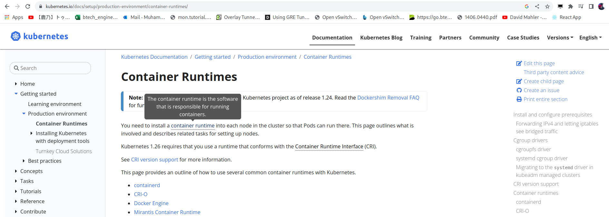

From kubernetes [docs](https://kubernetes.io/docs/setup/production-environment/container-runtimes/) container runtime is **the software that responsible for running containers.** so the runtime is like backend for container? 

well maybe,let's check one of them

#### Containerd
From containerd [readme](https://github.com/containerd/containerd#runtime-requirements) they say if containerd was need runtime and it's called runc

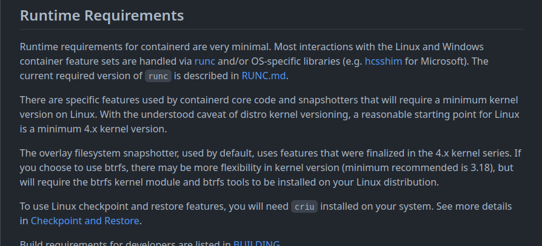

so it's chain runtime? from k8s > containerd > runc? idk let's check runc

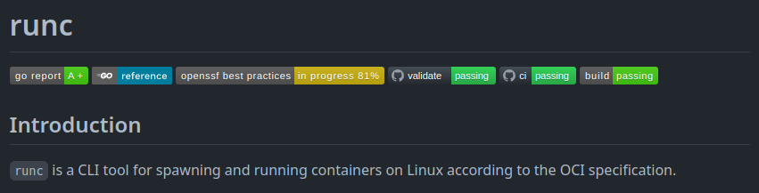

in readme [github](https://github.com/opencontainers/runc#runc) it's say *runc is tool for spawning and running containers on Linux according to the OCI specification* not very detail but at least it's give us some clue, the clue is whats is OCI?

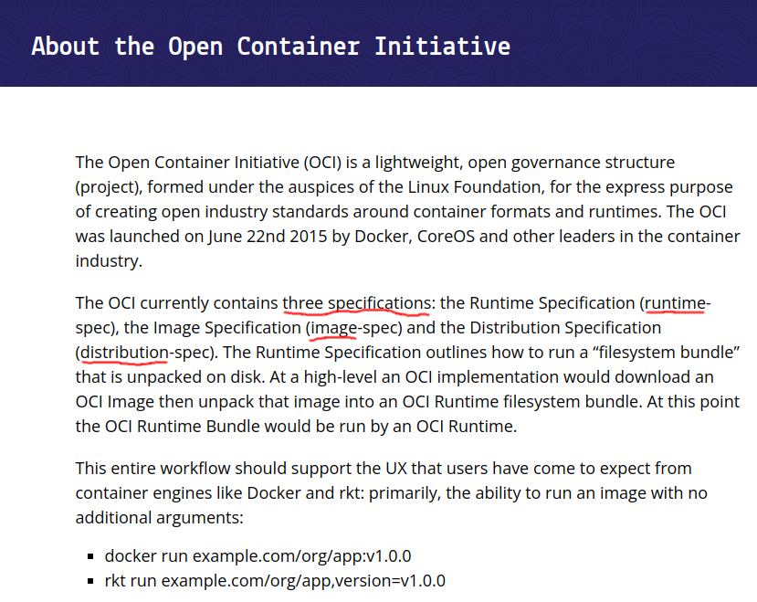

from the [website](https://opencontainers.org/about/overview/) it say pen Container Initiative aka OCI is a governance structure and that structure have 3 specifications (runtime,image,distribution)

in example if you exec docker run bla bla it will trigger/running that 3 specifications in background

so container technology was come from docker then docker open the runtime and it's called runc,ok now back to runc

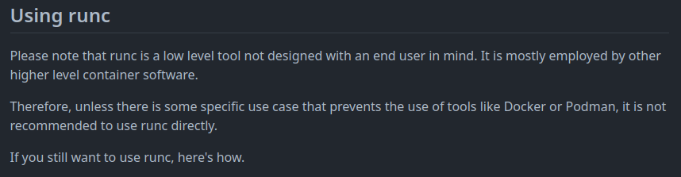

runc give us a note to not use it because runc was too low level,that's mean we almost jump into core of container technology :)

**In this step we need multiple terminal,so i tell you if we need another terminal**

let's open new terminal/window to recive the tty

the recive tty will blank because the sock still empty(no one use it), now let's run the container and fill the sock

the recive tty will droped into shell after i create the container,ok but now how to make sure if that shell was container?

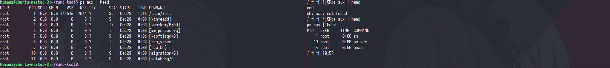

if i use ps aux to see the process list its will showing difference and of course in container the sh will have pid 1

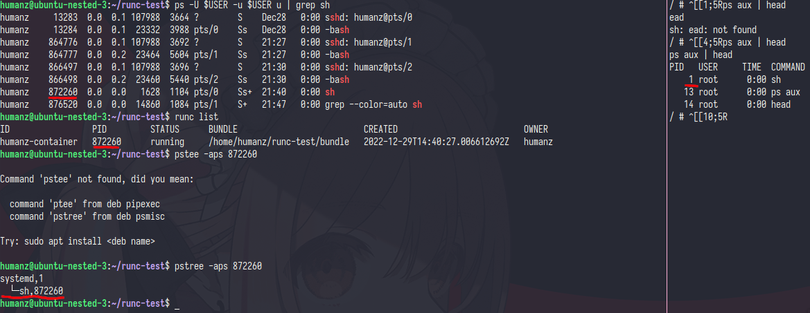

in container the sh pid was 1 but in host sh pid was 872260 and as you can see the container was directly running under systemd(pid 1) that's mean i running the container was natively whitout any OCI (just like runc say *spawning and running containers* )

but how can it happen? what magic behind all of this?

**NAMESPACE**

yep,namespace.

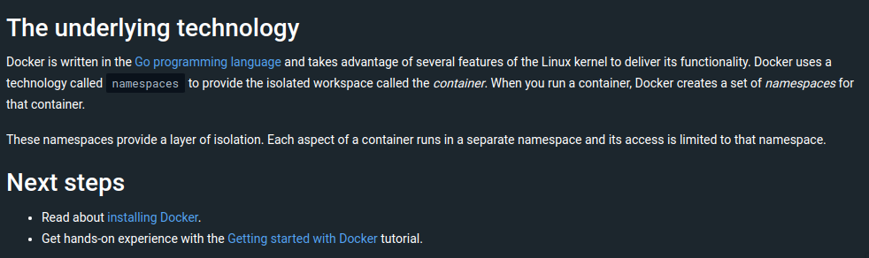

if you ever read the docker docs about their [architecture](https://docs.docker.com/get-started/overview/#docker-architecture) they already said it in last of page

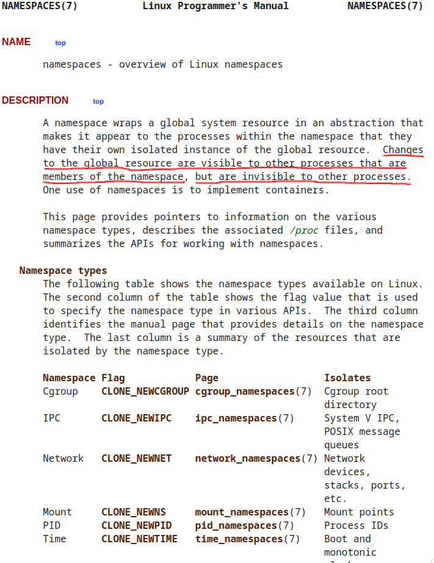

as the [manual page](https://man7.org/linux/man-pages/man7/namespaces.7.html) say **Changes to the global resource are visible to other processes that are members of the namespace, but are invisible to other processes**

so namespace was a isolated global system that what ever we do some change (running,deleting) a pid in new namespace the pid will showing in parent/current namespaces but the child/new namespaces can't see anything.

in example if i exec `ls -lah /proc/$$/ns` in both host and container some id namespace was same

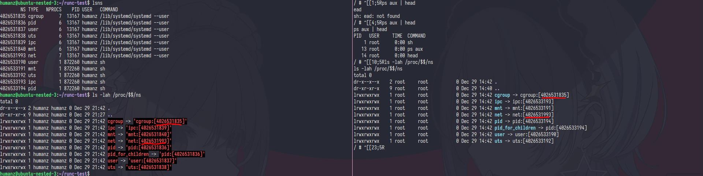

that make the container can see the same thing with the host,example like resource(cgroup) and network(net)

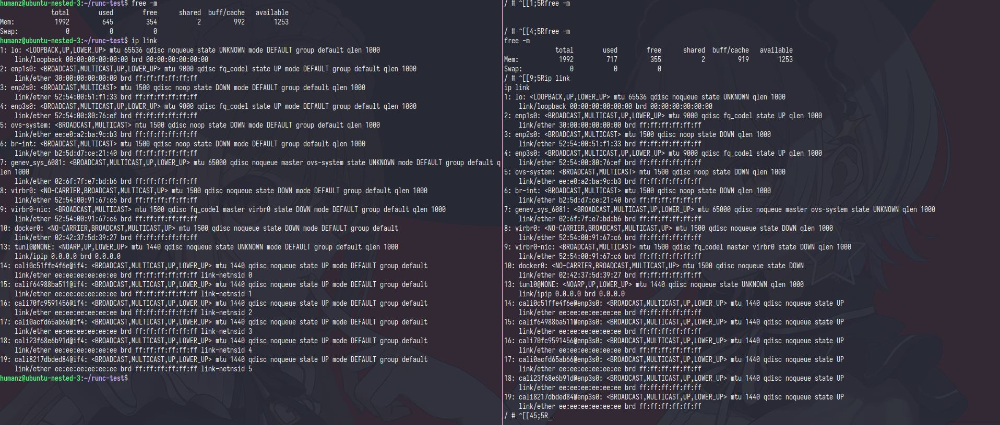

so yeah,if i change the network config in container(like add ip,del interface) the host will be effected because they have same namespace

if you want to sprated the network too you can edit the config.json and add the `{"type":"network"}` at end of namespaces object, like this one

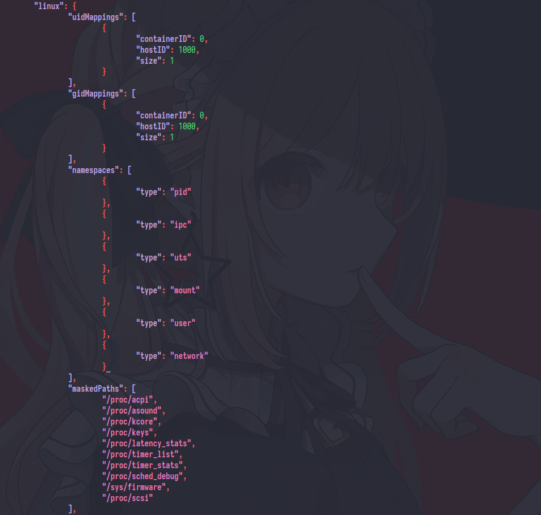

and rerun the container

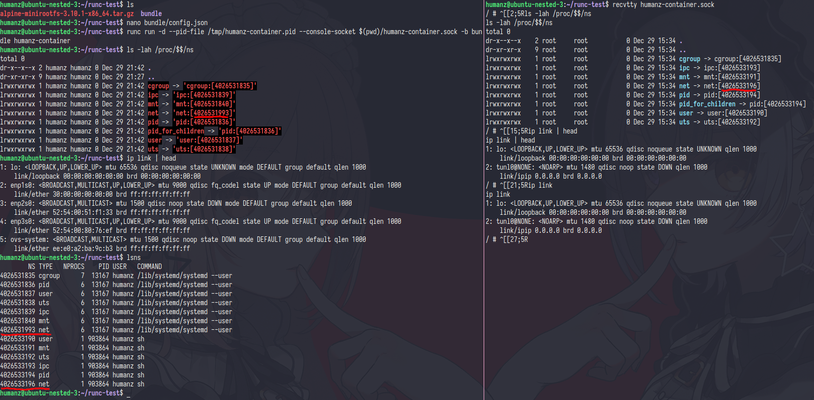

yep,the container network already sprated from host

------------------------------------------------------------------------------------------------------------------------------------------------------------------------
i think that's enough but i'm pretty sure if you still not fully understand and some part still mystery like how container rootless work? or how to setup the container network? or how runc fools the getpid() fuction?

to answer that you can find it by your self and trying what i do 

all steps was avalable on [my github](https://github.com/JustHumanz/Kube-dojo/blob/master/Pods/Container.md)

