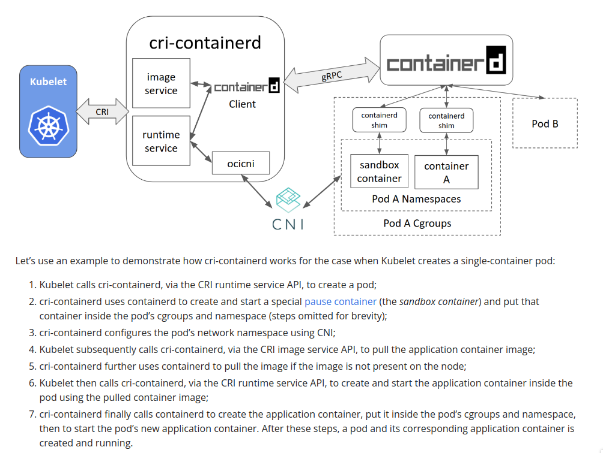
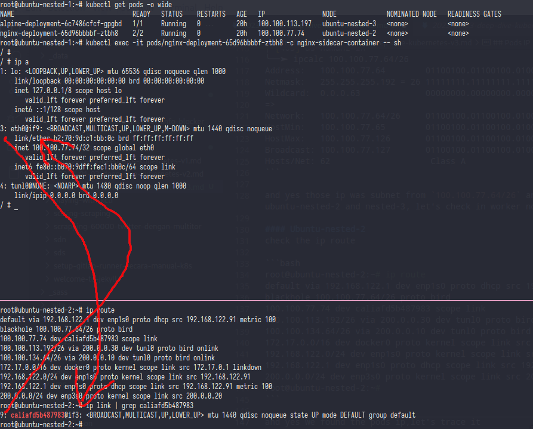
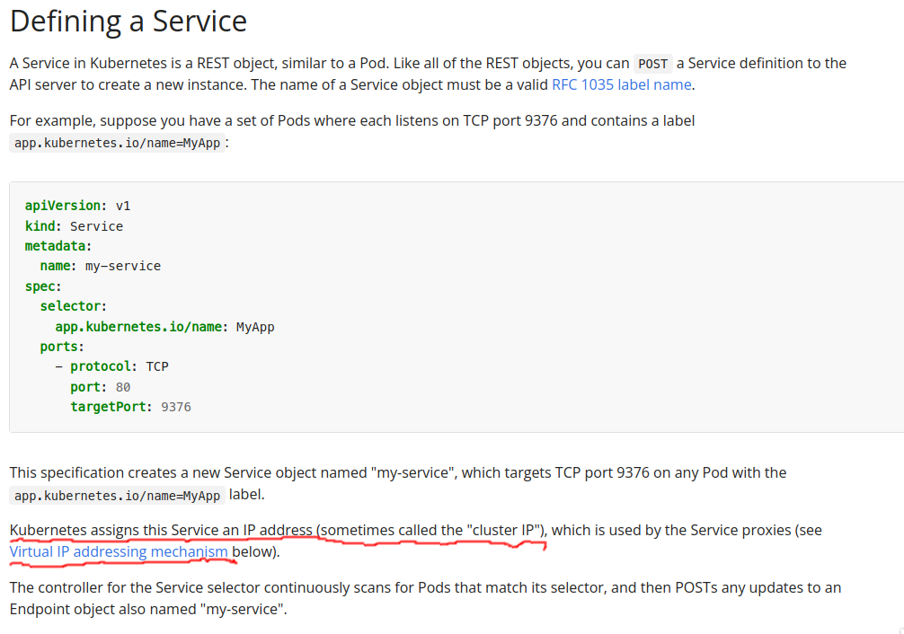
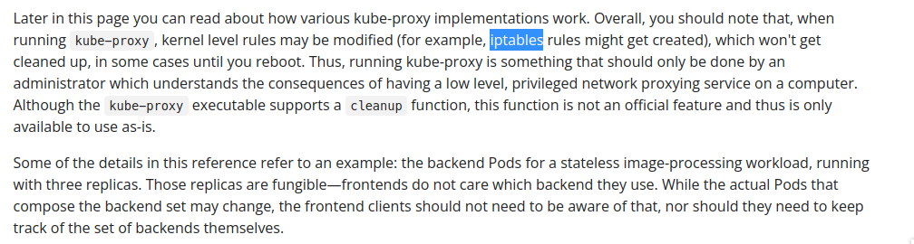
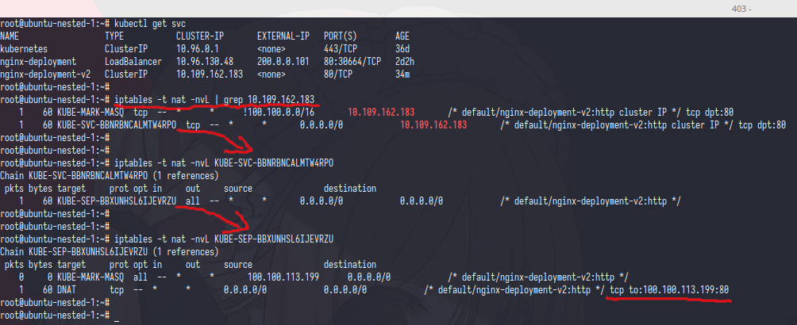
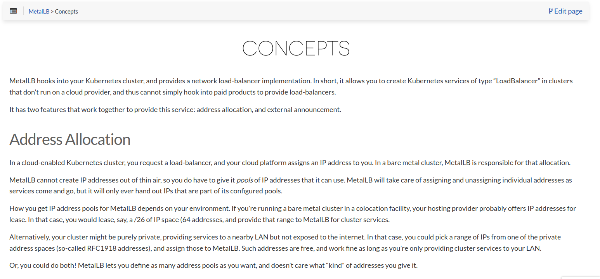
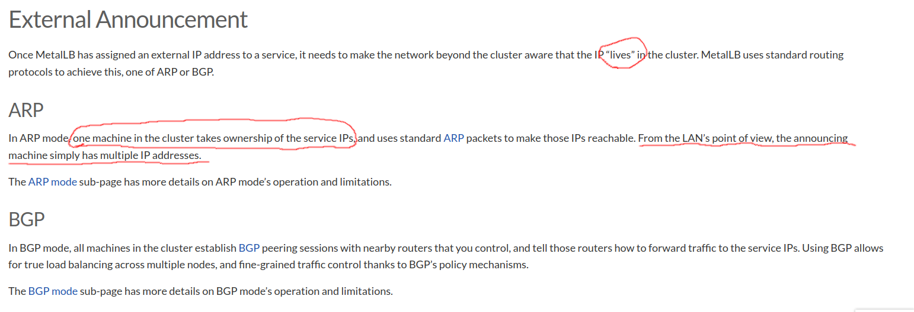
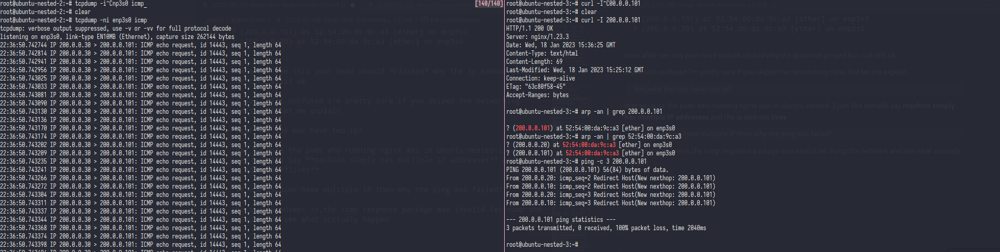

This was the third part from my journey to learn kubernetes at this time i'm will write about kubernetes networking.

Kubernetes networking was very complex many network type like pods ip,cluster ip,load balancer,node port,cni,etc but how that all works?

## CNI
Before we start to deep dive about network type in kubernetes better if we understand how kubernetes provide ip address to the pod.

from the offical [website CNI](https://www.cni.dev/) says:

```
a Cloud Native Computing Foundation project, consists of a specification and libraries for writing plugins to configure network interfaces in Linux containers, along with a number of supported plugins. CNI concerns itself only with network connectivity of containers and removing allocated resources when the container is deleted. Because of this focus, CNI has a wide range of support and the specification is simple to implement.
```

from that statement CNI is responsible to create/assign ip into container, but for better understanding we can see this image or you can read it on [kubernetes blog](https://kubernetes.io/blog/2017/11/containerd-container-runtime-options-kubernetes/) 




for the CNI i'm will use calico with IP-IP tunnel config (the default)

## Pods IP
```bash
root@ubuntu-nested-1:~# kubectl get pods -o wide
NAME                                 READY   STATUS    RESTARTS   AGE   IP                NODE              NOMINATED NODE   READINESS GATES
alpine-deployment-6c7486cfcf-gpgbd   1/1     Running   0          20h   100.100.113.197   ubuntu-nested-3   <none>           <none>
nginx-deployment-65d96bbbbf-ztbh8    2/2     Running   0          20h   100.100.77.74     ubuntu-nested-2   <none>           <none>
```

if i'm get pods with -o wide the ip address of pods will showing,let's try to ping it from master and outside kube cluster

```bash
root@ubuntu-nested-1:~# ping -c 3 100.100.113.197
PING 100.100.113.197 (100.100.113.197) 56(84) bytes of data.
64 bytes from 100.100.113.197: icmp_seq=1 ttl=63 time=0.273 ms
64 bytes from 100.100.113.197: icmp_seq=2 ttl=63 time=0.245 ms
64 bytes from 100.100.113.197: icmp_seq=3 ttl=63 time=0.323 ms

--- 100.100.113.197 ping statistics ---
3 packets transmitted, 3 received, 0% packet loss, time 2057ms
rtt min/avg/max/mdev = 0.245/0.280/0.323/0.035 ms
root@ubuntu-nested-1:~# ping -c 3 100.100.77.74
PING 100.100.77.74 (100.100.77.74) 56(84) bytes of data.
64 bytes from 100.100.77.74: icmp_seq=1 ttl=63 time=0.310 ms
64 bytes from 100.100.77.74: icmp_seq=2 ttl=63 time=0.347 ms
64 bytes from 100.100.77.74: icmp_seq=3 ttl=63 time=0.589 ms

--- 100.100.77.74 ping statistics ---
3 packets transmitted, 3 received, 0% packet loss, time 2047ms
rtt min/avg/max/mdev = 0.310/0.415/0.589/0.124 ms
```

from master those ip can be pinged

```bash
root@ubuntu-nested-9:~# ping -c 3 100.100.113.197
PING 100.100.113.197 (100.100.113.197) 56(84) bytes of data.

--- 100.100.113.197 ping statistics ---
3 packets transmitted, 0 received, 100% packet loss, time 2055ms

root@ubuntu-nested-9:~# ping -c 3 100.100.77.74
PING 100.100.77.74 (100.100.77.74) 56(84) bytes of data.

--- 100.100.77.74 ping statistics ---
3 packets transmitted, 0 received, 100% packet loss, time 2037ms
```

and if i'm try ping it from outside kube cluster the ip will not reachable

how can that happen?

let's check the ip route

```bash
root@ubuntu-nested-1:~# ip route
default via 192.168.122.1 dev enp1s0 proto dhcp src 192.168.122.173 metric 100
100.100.77.64/26 via 200.0.0.20 dev tunl0 proto bird onlink
100.100.113.192/26 via 200.0.0.30 dev tunl0 proto bird onlink
blackhole 100.100.134.64/26 proto bird
100.100.134.74 dev cali870616d106e scope link
100.100.134.75 dev cali8810d96950e scope link
100.100.134.76 dev cali94c25b1a2a2 scope link
100.100.134.77 dev cali70381e7433b scope link
100.100.134.78 dev cali3fc80ae6888 scope link
100.100.134.79 dev calid7ce1c6c7e4 scope link
172.17.0.0/16 dev docker0 proto kernel scope link src 172.17.0.1 linkdown
192.168.122.0/24 dev enp1s0 proto kernel scope link src 192.168.122.173
192.168.122.1 dev enp1s0 proto dhcp scope link src 192.168.122.173 metric 100
192.168.123.0/24 dev virbr0 proto kernel scope link src 192.168.123.1 linkdown
200.0.0.0/24 dev enp8s0 proto kernel scope link src 200.0.0.10
```

from that ip route you can see at `100.100.77.64/26 via 200.0.0.20` and `100.100.113.192/26 via 200.0.0.30` and the pods ip was `100.100.113.197` `100.100.77.74` let's calc it

```bash
╭─[403] as humanz in
╰──➤ ipcalc 100.100.113.192/26
Address:   100.100.113.192      01100100.01100100.01110001.11 000000
Netmask:   255.255.255.192 = 26 11111111.11111111.11111111.11 000000
Wildcard:  0.0.0.63             00000000.00000000.00000000.00 111111
=>
Network:   100.100.113.192/26   01100100.01100100.01110001.11 000000
HostMin:   100.100.113.193      01100100.01100100.01110001.11 000001
HostMax:   100.100.113.254      01100100.01100100.01110001.11 111110
Broadcast: 100.100.113.255      01100100.01100100.01110001.11 111111
Hosts/Net: 62                    Class A


╭─[403] as humanz in 
╰──➤ ipcalc 100.100.77.64/26
Address:   100.100.77.64        01100100.01100100.01001101.01 000000
Netmask:   255.255.255.192 = 26 11111111.11111111.11111111.11 000000
Wildcard:  0.0.0.63             00000000.00000000.00000000.00 111111
=>
Network:   100.100.77.64/26     01100100.01100100.01001101.01 000000
HostMin:   100.100.77.65        01100100.01100100.01001101.01 000001
HostMax:   100.100.77.126       01100100.01100100.01001101.01 111110
Broadcast: 100.100.77.127       01100100.01100100.01001101.01 111111
Hosts/Net: 62                    Class A
```

and yes those ip was subnet from `100.100.77.64/26` and `100.100.113.192/26` and don't forget if those ip was routed to 200.0.0.20 and 200.0.0.30 which is ubuntu-nested-2 and nested-3, let's check in worker nodes

##### Ubuntu-nested-2
Check the ip route

```bash
root@ubuntu-nested-2:~# ip route
default via 192.168.122.1 dev enp1s0 proto dhcp src 192.168.122.91 metric 100
blackhole 100.100.77.64/26 proto bird
100.100.77.74 dev caliafd5b487983 scope link
100.100.113.192/26 via 200.0.0.30 dev tunl0 proto bird onlink
100.100.134.64/26 via 200.0.0.10 dev tunl0 proto bird onlink
172.17.0.0/16 dev docker0 proto kernel scope link src 172.17.0.1 linkdown
192.168.122.0/24 dev enp1s0 proto kernel scope link src 192.168.122.91
192.168.122.1 dev enp1s0 proto dhcp scope link src 192.168.122.91 metric 100
200.0.0.0/24 dev enp3s0 proto kernel scope link src 200.0.0.20
```

and yes we found the pods ip,let's trace it 



as you can see `caliafd5b487983` device was linked into `nginx-deployment-65d96bbbbf-ztbh8` pods.

from that we can see if calico IP-IP is only routed ip address,now let's try add ip route into vm outside kubernetes cluster and do the ping

```bash
root@ubuntu-nested-9:~# ip route add 100.100.77.64/26 via 200.0.0.20
root@ubuntu-nested-9:~# ping -c 3 100.100.77.74
PING 100.100.77.74 (100.100.77.74) 56(84) bytes of data.
64 bytes from 100.100.77.74: icmp_seq=1 ttl=63 time=0.239 ms
64 bytes from 100.100.77.74: icmp_seq=2 ttl=63 time=0.209 ms
64 bytes from 100.100.77.74: icmp_seq=3 ttl=63 time=0.276 ms

--- 100.100.77.74 ping statistics ---
3 packets transmitted, 3 received, 0% packet loss, time 2025ms
rtt min/avg/max/mdev = 0.209/0.241/0.276/0.030 ms
```

if you want to deep dive the calico backend or learn more about bgp in kubernetes you can read the [The BIRD project](https://bird.network.cz/).


## Cluster IP
When you deploy some service you should get ClusterIP,but whats it's ClusterIP it's really ip address? can you ping it? 

let's read the manual first

In [kube doc](https://kubernetes.io/docs/concepts/services-networking/service/#defining-a-service),Cluster IP was *Virtual IP addressing*




Still in [kube doc](https://kubernetes.io/docs/reference/networking/virtual-ips) it's just says *virtual IP*,lmao


let's deep dive this *virtual IP*.

fist let's try to ping it

```bash
root@ubuntu-nested-1:~# kubectl get svc
NAME                  TYPE           CLUSTER-IP       EXTERNAL-IP   PORT(S)        AGE
kubernetes            ClusterIP      10.96.0.1        <none>        443/TCP        36d
nginx-deployment      LoadBalancer   10.96.130.48     200.0.0.101   80:30664/TCP   2d1h
nginx-deployment-v2   ClusterIP      10.109.162.183   <none>        80/TCP         5m51s
root@ubuntu-nested-1:~# ping -c 3 10.109.162.183
PING 10.109.162.183 (10.109.162.183) 56(84) bytes of data.

--- 10.109.162.183 ping statistics ---
3 packets transmitted, 0 received, 100% packet loss, time 2045ms
root@ubuntu-nested-1:~# arp -an | grep 10.109.162.183

```

bep bop,the ip was not reachable,now let's try to curl it

```
root@ubuntu-nested-1:~# kubectl get svc
NAME                  TYPE           CLUSTER-IP       EXTERNAL-IP   PORT(S)        AGE
kubernetes            ClusterIP      10.96.0.1        <none>        443/TCP        36d
nginx-deployment      LoadBalancer   10.96.130.48     200.0.0.101   80:30664/TCP   2d2h
nginx-deployment-v2   ClusterIP      10.109.162.183   <none>        80/TCP         23m
root@ubuntu-nested-1:~# curl 10.109.162.183
<html><head><title>Lon</title></head><body>Lon</body></html>
```

yoo what? why it's can be happen? the ping was unreachable but curl was ok.

now let's think,the ip was unreachable from icmp,arp also empty but curl was ok  

wait,let's try it on outside cluster
```bash
root@ubuntu-nested-9:~# ping -c 3 10.109.162.183
PING 10.109.162.183 (10.109.162.183) 56(84) bytes of data.

--- 10.109.162.183 ping statistics ---
3 packets transmitted, 0 received, 100% packet loss, time 2055ms

root@ubuntu-nested-9:~# curl 10.109.162.183
^C
root@ubuntu-nested-9:~#
```
heehehe same


the magic behind all of this was....... **iptables**


if you read the doc completely you may not surprised, let see again the doc



in that doc was clearly was **iptables rule might get created**

now let's check the rule



i hope you'r not skipping the iptables class, anyway fist ip get the table nat and grep the Cluster IP after that you can see if chain *KUBE-SVC-BLABLABLA* was have Cluster IP and from *KUBE-SVC-BLABLABLA* was referenced to *KUBE-SEP-BLABLA* chain

if we see *KUBE-SEP-BLABLA* chain is doing **DNAT** to ip 100.100.113.199 with port 80,let's check the ip in pods

```bash
root@ubuntu-nested-1:~# kubectl get pods -o wide  | grep 100.100.113.199
nginx-deployment-v2-9bbd6f4bc-6k5zh   2/2     Running   2          44m   100.100.113.199   ubuntu-nested-3   <none>           <none>
```

bingggo that ip was pods ip who run the nginx

now the question is,why kubernetes create many chain? why not directly **DNAT** it into pods?

before you answer that,let trying to add those iptables on outside kube cluster vm and try to curl the Cluster IP,

```bash
root@ubuntu-nested-9:~# iptables -t nat -N KUBE-SERVICE
root@ubuntu-nested-9:~# iptables -t nat -N KUBE-POD
root@ubuntu-nested-9:~# iptables -t nat -A PREROUTING KUBE-SERVICE
root@ubuntu-nested-9:~# iptables -t nat -A PREROUTING -j KUBE-SERVICE
root@ubuntu-nested-9:~# iptables -t nat -A OUTPUT -j KUBE-SERVICE
root@ubuntu-nested-9:~# iptables -t nat -A KUBE-SERVICE -d 10.109.162.183/32 -p tcp -m tcp --dport 80 -j KUBE-POD
root@ubuntu-nested-9:~# iptables -t nat -A KUBE-POD -p tcp -m tcp -j DNAT --to-destination 100.100.113.199:80
root@ubuntu-nested-9:~# ip route add 100.100.113.192/26 via 200.0.0.30
```
Now let's try to curl the cluster ip

```bash
root@ubuntu-nested-9:~# curl 10.109.162.183 -I
HTTP/1.1 200 OK
Server: nginx/1.23.3
Date: Wed, 18 Jan 2023 13:12:16 GMT
Content-Type: text/html
Content-Length: 60
Last-Modified: Tue, 17 Jan 2023 15:19:25 GMT
Connection: keep-alive
ETag: "63c6bc7d-3c"
Accept-Ranges: bytes
```

As expected,the ubuntu-nested-9 can do curl with Cluster IP

## LoadBalancer
**In this part i'm using metallb(arp) for my loadbalancer provider**


In Cluste Ip you only can do curl the service kubernetes from inside kubernetes cluster but what if i'm want to expose the service to internet or to outside kube cluster?

right loadbalancer the answer,but once again how it's work?

let's see the basic information from the [metallb website](https://v0-3-0--metallb.netlify.app/concepts/)



from here we know if metallb have two function,one is to allocate the ip addr and another one is expose the ip addr for loadbalancer




here was little bit intreasing,metallb say if the ip was "lives" also "one machine in the cluster takes ownership of the service IPs" and the last "machine simply has multiple IP addresses"  what that all meaning?

Time to deep dive

in my kube metallb was already setup, so i will skip the setup process.

here was my **IPAddressPool** config

```yaml
apiVersion: metallb.io/v1beta1
kind: IPAddressPool
metadata:
  name: default
  namespace: metallb-system
spec:
  addresses:
  - 200.0.0.100-200.0.0.120
  autoAssign: true
---
apiVersion: metallb.io/v1beta1
kind: L2Advertisement
metadata:
  name: default
  namespace: metallb-system
spec:
  ipAddressPools:
  - default
```

and the service who use loadbalancer is **nginx-deployment**

```bash
root@ubuntu-nested-1:~# kubectl get svc
NAME                  TYPE           CLUSTER-IP       EXTERNAL-IP   PORT(S)        AGE
kubernetes            ClusterIP      10.96.0.1        <none>        443/TCP        37d
nginx-deployment      LoadBalancer   10.96.130.48     200.0.0.101   80:30664/TCP   3d1h
nginx-deployment-v2   ClusterIP      10.109.162.183   <none>        80/TCP         23h
```

let's try to curl it

```bash
root@ubuntu-nested-1:~# curl 200.0.0.101
<html><head><title>Kano</title></head><body>Kano/鹿乃</body></html>
```

it's looks ok,now let's try from ouside kube cluster

```bash
root@ubuntu-nested-9:~# ip route
default via 192.168.122.1 dev enp1s0 proto dhcp src 192.168.122.33 metric 100
172.17.0.0/16 dev docker0 proto kernel scope link src 172.17.0.1 linkdown
192.168.122.0/24 dev enp1s0 proto kernel scope link src 192.168.122.33
192.168.122.1 dev enp1s0 proto dhcp scope link src 192.168.122.33 metric 100
192.168.123.0/24 dev virbr0 proto kernel scope link src 192.168.123.1 linkdown
200.0.0.0/24 dev enp3s0 scope link
root@ubuntu-nested-9:~# curl 200.0.0.101
<html><head><title>Kano</title></head><body>Kano/鹿乃</body></html>
```

from ubuntu-nested-9 who don't have any pods routing the curl was successfully. but how? in previous part if i want to curl cluster ip at least i should have the routing table of pods right? but now no routing table for reroute to pods

if you still confused or don't know the answer then you should **READ THE DOC REPEATEDLY**

of course it's because **ARP** just like metallb doc,now let's to prove it

**Inside kube cluster**
```bash
root@ubuntu-nested-1:~# arp -an | grep 200.0.0.101
? (200.0.0.101) at 52:54:00:da:9c:a3 [ether] on enp8s0
```

**Outside kube cluster**
```bash
root@ubuntu-nested-9:~# arp -an | grep 200.0.0.101
? (200.0.0.101) at 52:54:00:da:9c:a3 [ether] on enp3s0
```

Now the question is from where the mac address come? or since there mac address can i'm ping it?

let's try it


**Inside kube cluster**
```bash
root@ubuntu-nested-1:~# ping -c 3 200.0.0.101
PING 200.0.0.101 (200.0.0.101) 56(84) bytes of data.
From 200.0.0.20: icmp_seq=2 Redirect Host(New nexthop: 200.0.0.101)
From 200.0.0.20: icmp_seq=3 Redirect Host(New nexthop: 200.0.0.101)
From 200.0.0.20 icmp_seq=1 Destination Host Unreachable

--- 200.0.0.101 ping statistics ---
3 packets transmitted, 0 received, +1 errors, 100% packet loss, time 2038ms
```

**Outside kube cluster**
```bash
root@ubuntu-nested-9:~# ping -c 3 200.0.0.101
PING 200.0.0.101 (200.0.0.101) 56(84) bytes of data.
From 200.0.0.20: icmp_seq=2 Redirect Host(New nexthop: 200.0.0.101)
From 200.0.0.20: icmp_seq=3 Redirect Host(New nexthop: 200.0.0.101)
From 200.0.0.20 icmp_seq=1 Destination Host Unreachable
From 200.0.0.20 icmp_seq=2 Destination Host Unreachable
From 200.0.0.20 icmp_seq=3 Destination Host Unreachable

--- 200.0.0.101 ping statistics ---
3 packets transmitted, 0 received, +3 errors, 100% packet loss, time 2055ms
```

it's failed (?) well,let try to continue to check the mac address


**Inside kube cluster**
```bash
root@ubuntu-nested-1:~# arp -an | grep 52:54:00:da:9c:a3
? (200.0.0.101) at 52:54:00:da:9c:a3 [ether] on enp8s0
? (200.0.0.20) at 52:54:00:da:9c:a3 [ether] on enp8s0
```

**Outside kube cluster**
```bash
root@ubuntu-nested-9:~# arp -an | grep 52:54:00:da:9c:a3
? (200.0.0.101) at 52:54:00:da:9c:a3 [ether] on enp3s0
? (200.0.0.20) at 52:54:00:da:9c:a3 [ether] on enp3s0
```

Now after see this your head should *clicked* why the ip cannot pinged but curl still ok

If you still confused i'm pretty sure if you skiped the networking class. but let me explain

>Fist,why the mac have two ip?  

that because the pods who running nginx was in ubuntu-nested-2,just like metallb say **machine simply has multiple IP addresses** and the ip address **lives**

>If one machine have multiple IP then why the ping was failed?

the simply answer is,metallb fools the icmp package.let dump the network and see what acctualy happen



as you can see the tcpdump only showing **ICMP echo request** whitout any response that happen because the ip address(200.0.0.101) was fake,that ip was ever exist in first place.

>If icmp was failed,then why curl was fine?

if you read the Cluster IP correctly you should know this answer.  
remember the ip 200.0.0.101 was fake right? but keep in mind the request package was really really arrived in ubuntu-nested-2 who hosted the nginx pod right? 


## Ingress