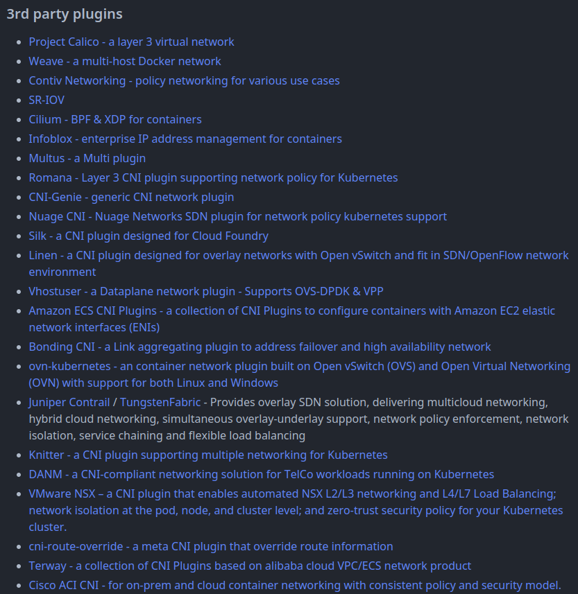
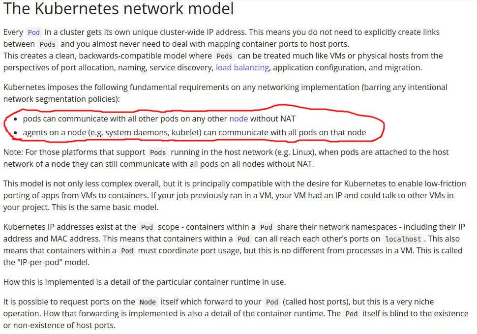
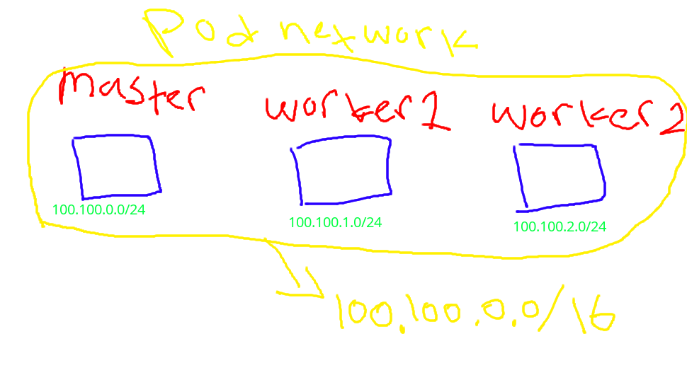
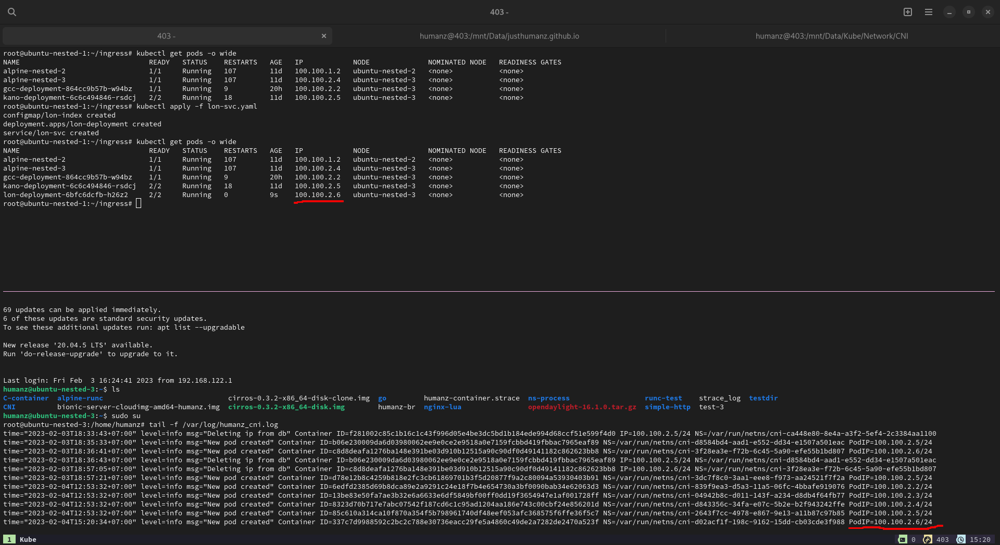

CNI or Container Network Interface is one of componect requerment to running kubernetes cluster,CNI is responsibility to connected kubernetes cluster ie: connection between pods,connection between pods with diffrent node.

Usualy if you using public cloud the CNI already configurated (not very sure,i'm never use public cloud #cmiiw)



I'm pretty sure if you was using one of [those CNI](https://github.com/containernetworking/cni#3rd-party-plugins)

--------------------------------

But in this time i'm will not talk/compare/benchmark about those CNI (compare/benchmark without knowing the basic of technology was dumb and waste your time), yep just like usually i will talk how to create it from scratch.

Before we jump to the code better if we know what is standar of kubernetes network model  


As you can see kubernetes network model need two requerments

- pod can communicate with another pods whitout NAT 
- agents can communicate with pods

Ok for now let's take this as note

###### Note
Before you continue to read this post better if you see my [kubernetes topology](https://github.com/JustHumanz/Kube-dojo/blob/master/Kube-init.md#topology)


## Create CNI plugin config
first we need to config file for CNI plugin

```bash
nano /etc/cni/net.d/10-humanz-cni-plugin.conf
```

```json
{
    "cniVersion": "0.3.1",
    "name": "humanz-cni",
    "type": "humanz-cni",
    "bridge": "humanz-cni0",
    "network": "100.100.0.0/16",
    "subnet": "100.100.X.0/24"
}
```
the cni plugin config file was formated in json and in that file was filled with cni config,like the name of cni,version,bridge,network and subnet (make sure the subnet was same with --pod-network-cidr when you deploye kubernetes)

populate that plugin on all kubernetes cluster but with different subnet




## Create cni plugin
clone [my repo](https://github.com/JustHumanz/Kube-dojo/tree/master/Network/CNI) and build it,after that copy the binary file to `/opt/cni/bin/humanz-cni` in all kube cluster

```bash
go build -o /opt/cni/bin/humanz-cni .
```

after that tail the log 
```bash
tail -f /var/log/humanz_cni.log
```

meanwhile tail the log let create a pods



As you can see the pod was created, now let's try to ping it

```bash
root@ubuntu-nested-1:~/ingress# ping -c 3 100.100.2.6
PING 100.100.2.6 (100.100.2.6) 56(84) bytes of data.

--- 100.100.2.6 ping statistics ---
3 packets transmitted, 0 received, 100% packet loss, time 2032ms

root@ubuntu-nested-1:~/ingress# curl 100.100.2.6
^C
root@ubuntu-nested-1:~/ingress#
```

huh it's fail,why?

the ping was from ubuntu-nested-1 and the pod was hosted on ubuntu-nested-3,let's check the ip route

```bash
root@ubuntu-nested-1:~# ip route
default via 192.168.122.1 dev enp1s0 proto dhcp src 192.168.122.173 metric 100 
100.100.0.0/24 dev humanz-cni0 proto kernel scope link src 100.100.0.1 
172.17.0.0/16 dev docker0 proto kernel scope link src 172.17.0.1 linkdown 
192.168.122.0/24 dev enp1s0 proto kernel scope link src 192.168.122.173 
192.168.122.1 dev enp1s0 proto dhcp scope link src 192.168.122.173 metric 100 
192.168.123.0/24 dev virbr0 proto kernel scope link src 192.168.123.1 linkdown 
200.0.0.0/24 dev enp8s0 proto kernel scope link src 200.0.0.10 
root@ubuntu-nested-1:~#
```

As you can see,there is no route table to 100.100.2.0/24 which is subnet of ubuntu-nested-3.


Now let's add the route table
```bash
root@ubuntu-nested-1:~# ip route add 100.100.2.0/24 via 200.0.0.30 dev enp8s0
------------------------------------------------------------------------
root@ubuntu-nested-3:# ip route add 100.100.0.0/24 via 200.0.0.10 dev enp3s0
```

let's try to ping&curl again
```
root@ubuntu-nested-1:~# ping -c 3 100.100.2.6
PING 100.100.2.6 (100.100.2.6) 56(84) bytes of data.
64 bytes from 100.100.2.6: icmp_seq=1 ttl=63 time=0.290 ms
64 bytes from 100.100.2.6: icmp_seq=2 ttl=63 time=0.365 ms
64 bytes from 100.100.2.6: icmp_seq=3 ttl=63 time=0.084 ms

--- 100.100.2.6 ping statistics ---
3 packets transmitted, 3 received, 0% packet loss, time 2050ms
rtt min/avg/max/mdev = 0.084/0.246/0.365/0.119 ms
root@ubuntu-nested-1:~# curl 100.100.2.6
Lon/ろん
root@ubuntu-nested-1:~#
```

And yes,it's working fine