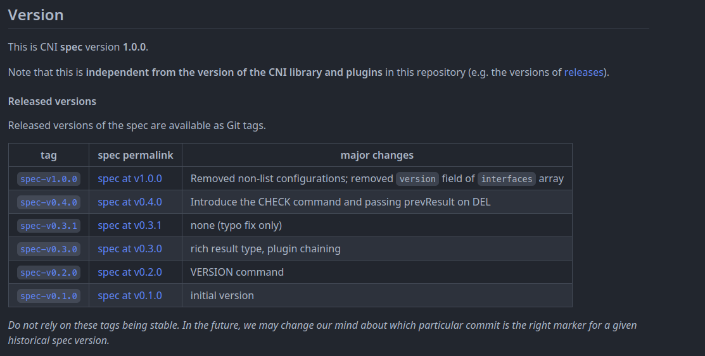
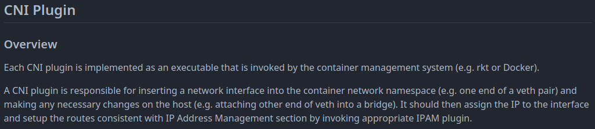
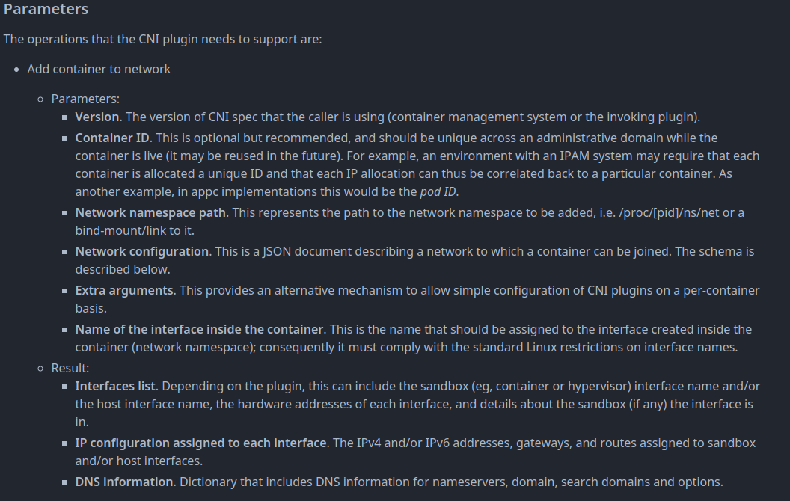
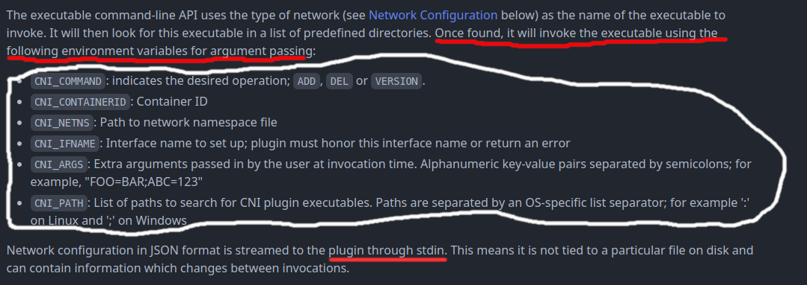
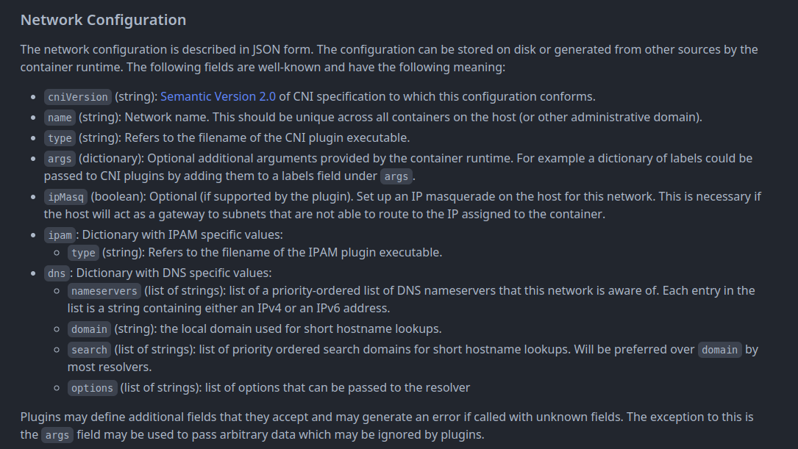

Before we jump into the code better if we understanding what is CNI or procedure to create CNI plugin.



Since i'm using v0.3.1 so we go to [v0.3.1 tag](https://github.com/containernetworking/cni/blob/spec-v0.3.1/SPEC.md)




In sort,cni plugin was who responsible to give the container IP addresss and connecti it to kube cluster.



CNI give the plugin parameters when kubernetes trying to create/delete the container, for now keep in mind this parameter



If we scroll a little bit it's will say *executable using the following environment variables* so it will be like `humanz@root#CNI_COMMAND=bla bla CNI_CONTAINERID=bla bla CNI_NETNS=bla ./cni-plugin` and then the cni plugin will get the data from env



In network configuration it's describe show to make the config it's self,remember in part one i'm was putting **10-humanz-cni-plugin.conf** in **/etc/cni/net.d/** ? yes that was the network configuration.


## Start the code
from here i was expecting if you already experienced with golang

first create the network config struct

```golang
type Humanz_CNI struct {
	CniVersion string `json:"cniVersion"`
	Name       string `json:"name"`
	Type       string `json:"type"`
	Bridge     string `json:"bridge"`
	Network    string `json:"network"`
	Subnet     string `json:"subnet"`
}

type Humanz_CNI_Storage struct {
	IP   string `json:"IP"`
	Used bool   `json:"Used"`
}
```
 the **Humanz_CNI** strcut was for read the network config file and **Humanz_CNI_Storage** to CRUD pods ip address


```golang
var (
	logger = log.New()
)

func init() {
	runtime.LockOSThread()
}

func main() {
	logger.SetOutput(os.Stdout)

	file, err := os.OpenFile(LOG_FILE, os.O_WRONLY|os.O_CREATE|os.O_APPEND, 0755)
	if err != nil {
		logger.Fatal(err)
	}
	defer file.Close()
	logger.SetOutput(file)

	skel.PluginMain(cmdAdd, cmdCheck, cmdDel, version.All, buildversion.BuildString(pluginName))
}
```

the **logger** variable is just for logging the cni,don't forget to set the **runtime** so the cni will not jump into another namespaces, **skel** package is warper args parser, so when the cni want to add new pod the cni plugin will exec **cmdAdd** fuction and **cmdDel** for deleting the pod.

no let's see the **cmdAdd** first

```golang
func cmdAdd(args *skel.CmdArgs) error {
	sb := Humanz_CNI{}
	err := json.Unmarshal(args.StdinData, &sb)
	if err != nil {
		return err
	}

	IPS := InitDB(sb.Subnet)
	BridgeName := sb.Bridge
	gatewayIP, gatewayNet, err := net.ParseCIDR(IPS[0].IP)
	if err != nil {
		return err
	}

	Gate := net.IPNet{
		IP:   gatewayIP,
		Mask: gatewayNet.Mask,
	}

	br, err := CreateBridge(BridgeName, MTU, &Gate)
	if err != nil {
		return err
	}

	netns, err := ns.GetNS(args.Netns)
	if err != nil {
		return err
	}
	defer netns.Close()

	PodIP, err := GeneratePodsIP()
	if err != nil {
		return err
	}

	err = SetupVeth(netns, br, args.IfName, PodIP, gatewayIP)
	if err != nil {
		return err
	}

	logger.WithFields(log.Fields{
		"NS":           netns.Path(),
		"PodIP":        PodIP.String(),
		"Container ID": args.ContainerID,
	}).Info("New pod created")

	result := &current.Result{
		CNIVersion: sb.CniVersion,
		IPs: []*current.IPConfig{
			{
				Address: *PodIP,
				Gateway: gatewayIP,
			},
		},
	}

	return types.PrintResult(result, sb.CniVersion)

}
```

it's a lot but let me explain it one by one.

```golang
sb := Humanz_CNI{}
err := json.Unmarshal(args.StdinData, &sb)
if err != nil {
    return err
}
```
in here i'm just unmarshal/read the network config and yes i'm take the data from stdin just like doc say *JSON format is streamed to the plugin through stdin*

```golang
IPS := InitDB(sb.Subnet)
BridgeName := sb.Bridge
gatewayIP, gatewayNet, err := net.ParseCIDR(IPS[0].IP)
if err != nil {
    return err
}
```
after that i'm was calc the subnet in **InitDB** fuction, in example

```json
[
    {
        "IP"   : "100.100.0.1/24",
        "Used" : true,
    },
    {
        "IP"   : "100.100.0.2/24",
        "Used" : false,
    }.
    {
        "IP"   : "100.100.0.3/24",
        "Used" : false,
    }.    
]
```
the subnet was `100.100.0.0/24` so it's will return an array with Humanz_CNI_Storage format,so it's will look like

```golang
BridgeName := sb.Bridge
gatewayIP, gatewayNet, err := net.ParseCIDR(IPS[0].IP)
if err != nil {
    return err
}

Gate := net.IPNet{
    IP:   gatewayIP,
    Mask: gatewayNet.Mask,
}

br, err := CreateBridge(BridgeName, MTU, &Gate)
if err != nil {
    return err
}
```
here i was create the bridge beetwen veth and os network.`IPS[0]` that will take the fist item of list and the first item will become the gateway 

```golang
netns, err := ns.GetNS(args.Netns)
if err != nil {
    return err
}
defer netns.Close()

PodIP, err := GeneratePodsIP()
if err != nil {
    return err
}

err = SetupVeth(netns, br, args.IfName, PodIP, gatewayIP)
if err != nil {
    return err
}
```
after the bridge getting created now i can create the veth interface and set the ip address, first is getting the linux namespaces after that get the free ip from IPS array, the last is creating the veth interfaces and set ip&default route

```golang
logger.WithFields(log.Fields{
    "NS":           netns.Path(),
    "PodIP":        PodIP.String(),
    "Container ID": args.ContainerID,
}).Info("New pod created")

result := &current.Result{
    CNIVersion: sb.CniVersion,
    IPs: []*current.IPConfig{
        {
            Address: *PodIP,
            Gateway: gatewayIP,
        },
    },
}

return types.PrintResult(result, sb.CniVersion)
```

the last is just logging and return result if the pods already setup the ip address.

from this steps the pods should be can created with the ip address,now the question is how to add ip route/firewall or create it deployment like others cni plugin? 

i will trying to explain that all on next part


for full code you can see and review it on [kube-dojo](https://github.com/JustHumanz/Kube-dojo/tree/e3b24b1f837cacc607f84d646ea5d3fe07822b58/Network/CNI)

