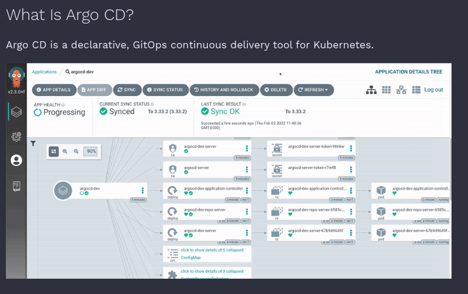

supppp guyssss, lately i'm very bored since my task at work already done and i have so much free time and i'm ended with playing dota 2 without knowing if this game slowly but surely devour my souls haahahaha,

ok back to post, yeah lately i'm very very bored and i want trying something new or something that very lame from my perspective, yep i'm learning devops :3 


first of all, this is not the first time i'm learing about devops, I already have some expriance in [past](../setup-gitlab-runner-secara-manual-k8s/2021-03-25-setup-gitlab-runner-secara-manual-k8s.md) on that time i'm learing how to create kube service account for deploying the app into kubernetes, but yeah that was old ways. nowdays we have many ways for deploying app in kubernetes and one of the way is using argocd.


first, what is argocd?


# Argocd



yep, very simple description :3

*if you still not understand aboud git,containerization app,app deployment,kubernetes u can skip this post or u should understand all of those element*

> why argocd?

well, in past when i setup my cicd i need to create service account or kube rbac in every app (or at least every namespaces) and that was take a long time to manage but nowdays argocd can easily create it automatically per application also with argocd we can track more easily the deploy version, so yeah argocd save more time.

in my perfective, argocd is just like libvirt in linux, well yes we can run virtual machine only with qemu but it's painfull as hell so we use libvirt qemu to handle it right?

ok let's start with repo directory structure
```bash
.
├── app
│   ├── go.mod
│   ├── go.sum
│   └── main.go
├── Dockerfile
├── manifest
│   ├── base
│   │   ├── app-deployment.yaml
│   │   ├── app-ingress.yaml
│   │   ├── app-svc.yaml
│   │   └── kustomization.yaml
│   └── overlay
│       └── prod
│           └── kustomization.yaml
└── README.md
```


