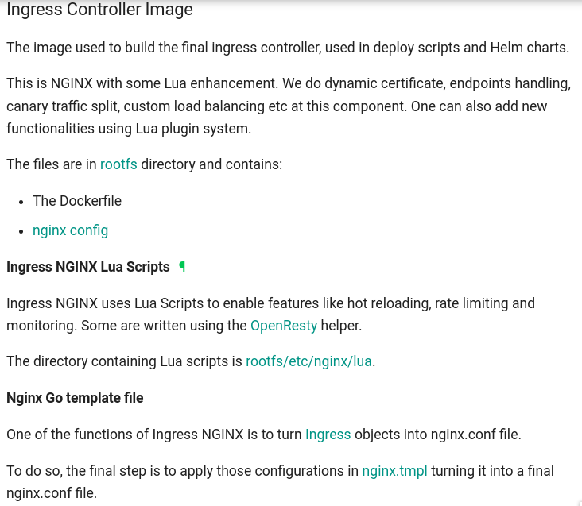
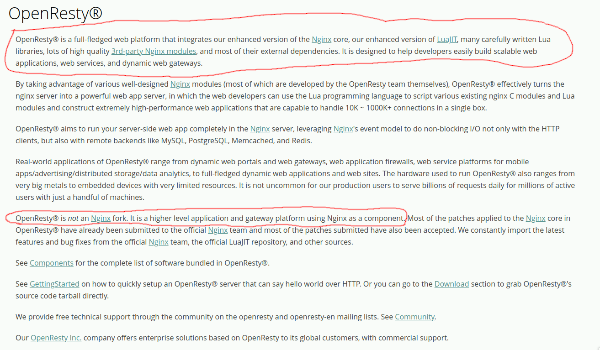
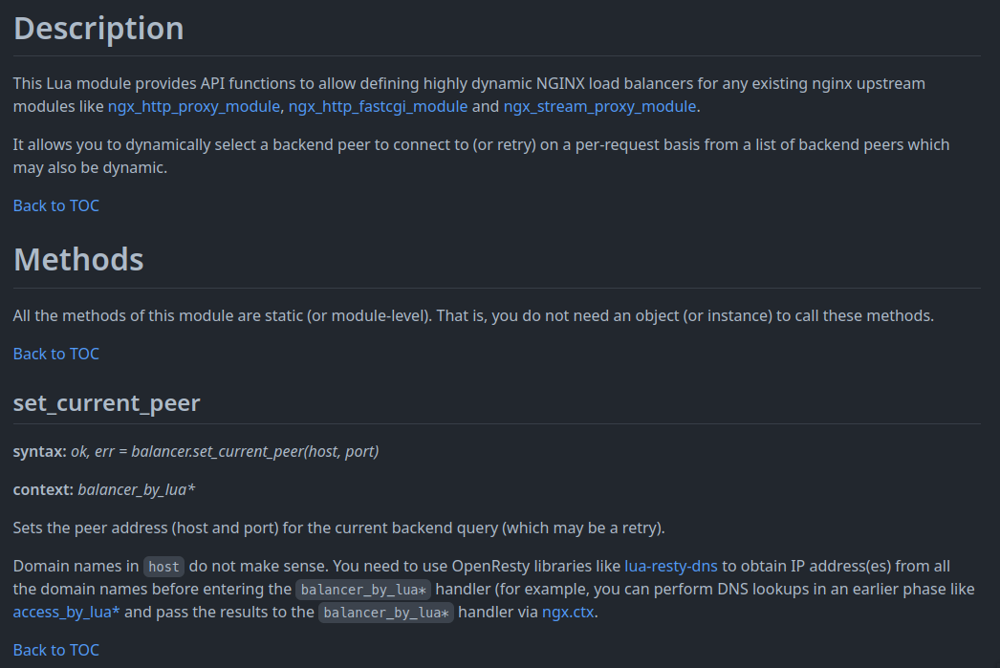
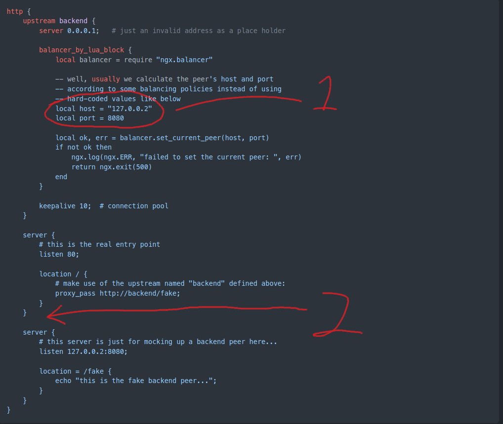

In my last post i was talking about ingress from kubernetes,one flow from ingress make me more curious, how can nginx-ingress updating the upstream with zero down time? if you ever setting up nginx with upstream and want to update the upstream you should restart/reload the nginx right? but in this case i don't see if nginx-ingress reload the nginx service also some public cloud have their load balancer with dynamic upstream (?) i'm don't very know their lb works on L3 or L7 but i'm pretty sure if they have L3 and L7 LB.



From nginx-ingress [doc](https://kubernetes.github.io/ingress-nginx/developer-guide/code-overview/#ingress-nginx-lua-scripts) they say if nginx-ingress use lua-script for endpoint handling

After googling i'm found [OpenResty](https://openresty.org/en/) who focust to build nginx-lua



Now i'm already get the map,let's start our adventure.
### Installing
- `wget -O - https://openresty.org/package/pubkey.gpg | sudo apt-key add -`
- `echo "deb http://openresty.org/package/ubuntu $(lsb_release -sc) main" > /etc/apt/sources.list.d/openresty.list`
- `apt update`
- `apt install openresty`
- `systemctl stop openresty.service`



I'm found the [module](https://github.com/openresty/lua-resty-core/blob/master/lib/ngx/balancer.md) who have function to setting up upstream dynamicly 




Here was the [example code](https://github.com/openresty/lua-resty-core/blob/master/lib/ngx/balancer.md#http-subsystem),from this we can modify it

1. We need to change it to array or object,so add/del new upstream can be possible
2. We need add more backend flow,i just think if we can add new servers block and add the backend flow in that block

## Time to code

```lua
http {
    error_log logs/error.log;

    init_by_lua_block {
        cjson = require "cjson"
        balancer = require("ngx.balancer")

        upstream_servers = {}
        end
    }    
}
```

First i'm init the lua with load the json&balancer module and declare the `upstream_servers` 

```lua
    upstream backend {
        server 127.0.0.1 fail_timeout=3;
        balancer_by_lua_block {
            local server = upstream_servers[math.random(#upstream_servers)]

            ok, err = balancer.set_current_peer(server)
            if not ok then
                ngx.log(ngx.ERR, "set_current_peer failed: ", err)
                return ngx.exit(500)
            end
        }
    }
```

Second, add the upstream,in here i'm name it backend.

in lua_block i'm declare the server variable who take the choice the item with random array,after that i'm set the server variable to current_peer

```
# app 
server {
    listen 80;

    location / {
        proxy_pass http://backend;
    }
}

# controller
server {
    listen 9091;
    location /config {
        content_by_lua_block {
            if ngx.var.request_method == "GET" then
                ngx.status = ngx.HTTP_OK
                local upstream_servers_json = cjson.encode(upstream_servers)
                ngx.print(upstream_servers_json)
                return
            end
            
            if ngx.var.request_method ~= "POST" then
                ngx.status = ngx.HTTP_BAD_REQUEST
                ngx.print("Only POST and GET requests are allowed!")
                return
            end

            ngx.req.read_body()
            local body = cjson.decode(ngx.req.get_body_data())
            local action = body['action']
            local new_stream = body['ip'] .. ":" .. body['port']

            if action == "add" then
                _, val = find_upstream_servers(new_stream)
                if val == nil then
                    table.insert(upstream_servers,new_stream)
                    ngx.log(ngx.INFO, "New upstream" .. new_stream)
                    update_balancer_tries()
                else
                    ngx.print("Upstream already exist")
                end

            elseif action == "del" then
                key, val = find_upstream_servers(new_stream)
                if key == 0 then
                    ngx.print("Upstream not found")
                else
                    table.remove(upstream_servers,key)
                    update_balancer_tries()
                    ngx.log(ngx.INFO, "Delete upstream" .. val)
                end                    
            else 
                ngx.print("Invalid action")
            end
            }
    }

    
    #location = /healthcheck {
        ## TODO,add healthcheck
    #}        
}
```

In #app server block it's will be the gateway of application meanwhile #controller server block will be backend flow just like i'm said in point 2.


```lua
if ngx.var.request_method == "GET" then
    ngx.status = ngx.HTTP_OK
    local upstream_servers_json = cjson.encode(upstream_servers)
    ngx.print(upstream_servers_json)
    return
end

if ngx.var.request_method ~= "POST" then
    ngx.status = ngx.HTTP_BAD_REQUEST
    ngx.print("Only POST and GET requests are allowed!")
    return
end
```

The backend flow only accept the GET and POST method. if the request is GET the nginx will print the current upstreams

```lua
ngx.req.read_body()
local body = cjson.decode(ngx.req.get_body_data())
local action = body['action']
local new_stream = body['ip'] .. ":" .. body['port']
```
From here the nginx will read the payload and decode the json to object,

```lua
if action == "add" then
    _, val = find_upstream_servers(new_stream)
    if val == nil then
        table.insert(upstream_servers,new_stream)
        ngx.log(ngx.INFO, "New upstream" .. new_stream)
        update_balancer_tries()
    else
        ngx.print("Upstream already exist")
    end

elseif action == "del" then
    key, val = find_upstream_servers(new_stream)
    if key == 0 then
        ngx.print("Upstream not found")
    else
        table.remove(upstream_servers,key)
        update_balancer_tries()
        ngx.log(ngx.INFO, "Delete upstream" .. val)
    end                    
else 
    ngx.print("Invalid action")
end
```
Here was the backend logic,if payload action is `add` then the nginx will update the upstream and reverse for `del` action.

```lua
function find_upstream_servers(key)
    for k,v in pairs(upstream_servers) do
        if v == key then
            return k,v
        end
    end
    return 0,nil
end

function update_balancer_tries()
    ok, err = balancer.set_more_tries(#upstream_servers - 1)
    if not ok then
        ngx.log(ngx.ERR, "set_more_tries failed: ", err)
    end
end
```
Since add/del need to read the upstream object so i'm create func to make it more easy.


Wrap it on one config file

```lua
worker_processes  1;
events {
    worker_connections  1024;
}

http {
    error_log logs/error.log;

    init_by_lua_block {
        cjson = require "cjson"
        balancer = require("ngx.balancer")

        upstream_servers = {}

        function find_upstream_servers(key)
            for k,v in pairs(upstream_servers) do
                if v == key then
                  return k,v
                end
            end
            return 0,nil
        end

        function update_balancer_tries()
            ok, err = balancer.set_more_tries(#upstream_servers - 1)
            if not ok then
                ngx.log(ngx.ERR, "set_more_tries failed: ", err)
            end
        end
        
    }
    
    upstream backend {
        server 127.0.0.1 fail_timeout=3;
        balancer_by_lua_block {

            -- Pick a random backend
            local server = upstream_servers[math.random(#upstream_servers)]
    
            ok, err = balancer.set_current_peer(server)
            if not ok then
                ngx.log(ngx.ERR, "set_current_peer failed: ", err)
                return ngx.exit(500)
            end
        }
    }
    
    # app 
    server {
        listen 80;

        location / {
            proxy_pass http://backend;
        }
    }

    # controller
    server {
        listen 9091;
        location /config {
            content_by_lua_block {
                if ngx.var.request_method == "GET" then
                    ngx.status = ngx.HTTP_OK
                    local upstream_servers_json = cjson.encode(upstream_servers)
                    ngx.print(upstream_servers_json)
                    return
                end
                
                if ngx.var.request_method ~= "POST" then
                    ngx.status = ngx.HTTP_BAD_REQUEST
                    ngx.print("Only POST and GET requests are allowed!")
                    return
                end

                ngx.req.read_body()
                local body = cjson.decode(ngx.req.get_body_data())
                local action = body['action']
                local new_stream = body['ip'] .. ":" .. body['port']

                if action == "add" then
                    _, val = find_upstream_servers(new_stream)
                    if val == nil then
                        table.insert(upstream_servers,new_stream)
                        ngx.log(ngx.INFO, "New upstream" .. new_stream)
                        update_balancer_tries()
                    else
                        ngx.print("Upstream already exist")
                    end

                elseif action == "del" then
                    key, val = find_upstream_servers(new_stream)
                    if key == 0 then
                        ngx.print("Upstream not found")
                    else
                        table.remove(upstream_servers,key)
                        update_balancer_tries()
                        ngx.log(ngx.INFO, "Delete upstream" .. val)
                    end                    
                else 
                    ngx.print("Invalid action")
                end
             }
        }

        # TODO add healthcheck
        # location = /healthcheck {
        #     access_by_lua_block {
        #     }
        # }        
    }
}
```

# Time to test
```bash
root@ubuntu-nested-2:~/nginx-lua# openresty -c $(pwd)/nginx.conf -t
nginx: the configuration file /root/nginx-lua/nginx.conf syntax is ok
nginx: configuration file /root/nginx-lua/nginx.conf test is successful
root@ubuntu-nested-2:~/nginx-lua#
```
Make sure the test was ok

Create simple web service

```go
package main

import (
        "fmt"
        "net/http"
        "os"
)

func main() {
        argsRaw := os.Args
        http.HandleFunc("/", func(w http.ResponseWriter, r *http.Request) {
                fmt.Fprintln(w, "Hello from", argsRaw[2])
        })

        http.ListenAndServe(argsRaw[1], nil)
}
```
This just simple web from go who print a string from args

```bash
go build -o simple_web .
```
Then build it

```bash
for i in {1..3};do (./simple_web localhost:111$i web_$i &) ;done
```
And the last was run it on background,you can check if the service was already running or not `netstat -tulpn | grep simple`.


Now let test the nginx with dynamic balancer


```bash
openresty -c $(pwd)/nginx.conf
```
Run the openresty


```bash
tail -f /usr/local/openresty/nginx/logs/error.log
```
In another terminal/tap you can tail the error log 


```bash
root@ubuntu-nested-2:~/nginx-lua# curl localhost
<html>
<head><title>500 Internal Server Error</title></head>
<body>
<center><h1>500 Internal Server Error</h1></center>
<hr><center>openresty/1.21.4.1</center>
</body>
</html>
root@ubuntu-nested-2:~/nginx-lua#
```
When do curl for first time it's will showing an error because the upstream_servers array still empty,we need fill it before

```bash
curl -X POST -d '{"action":"add","ip":"127.0.0.1","port":1111}' http://localhost:9091/config
```
Create a POST request,where action is add and ip was 127.0.0.1:1111 same like the simple web server who already run **Make sure you use ip address,not domain like localhost**

```bash
root@ubuntu-nested-2:~/nginx-lua# curl localhost
Hello from web_1
root@ubuntu-nested-2:~/nginx-lua#
```
As you can see the response now not 500 error,let's add one more upstream

```bash
root@ubuntu-nested-2:~/nginx-lua# curl -X POST -d '{"action":"add","ip":"127.0.0.1","port":1112}' http://localhost:9091/config
root@ubuntu-nested-2:~/nginx-lua# curl localhost
Hello from web_2
```
Yep,the upstream as updated whitout restart/reload the nginx

```bash
root@ubuntu-nested-2:~/nginx-lua# curl localhost
Hello from web_2
root@ubuntu-nested-2:~/nginx-lua# curl localhost
Hello from web_1
root@ubuntu-nested-2:~/nginx-lua# curl localhost
Hello from web_2
root@ubuntu-nested-2:~/nginx-lua# curl localhost
Hello from web_1
root@ubuntu-nested-2:~/nginx-lua# curl localhost
Hello from web_2
```

If i'm do it multiple time it's will showing from 1 or 2 whitout any consisten because we use random for select the upstream.

Now let try to delete one upstream

```bash
root@ubuntu-nested-2:~/nginx-lua# curl -X POST -d '{"action":"del","ip":"127.0.0.1","port":1111}' http://localhost:9091/config
root@ubuntu-nested-2:~/nginx-lua# curl localhost
Hello from web_2
root@ubuntu-nested-2:~/nginx-lua# curl localhost
Hello from web_2
root@ubuntu-nested-2:~/nginx-lua# curl localhost
Hello from web_2
root@ubuntu-nested-2:~/nginx-lua# curl localhost
Hello from web_2
```

The upstream was updated and the response was never showing from web_1,or if you want to see the current upstream you can use GET method

```bash
root@ubuntu-nested-2:~/nginx-lua# curl -s http://localhost:9091/config | jq
[
  "127.0.0.1:1112"
]
```


Reference:
- https://kura.gg/2020/08/30/configuring-upstreams-dynamically-with-dns-in-openresty/
- https://github.com/openresty/lua-resty-core/blob/master/lib/ngx/balancer.md