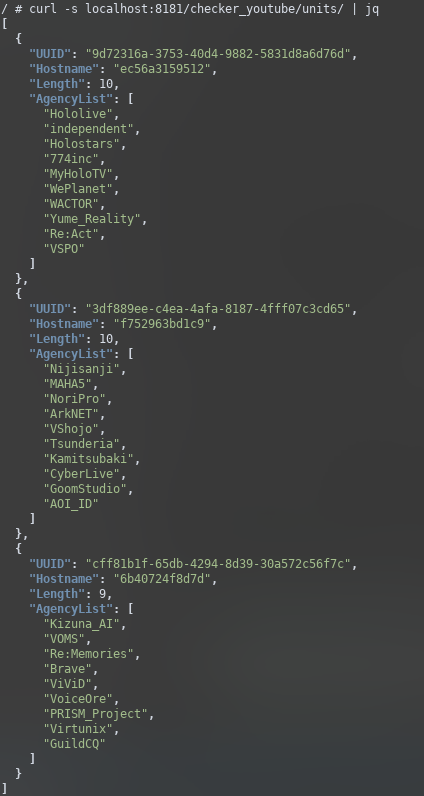

Last time my problem was limitation from other resource,but after success to solve it i face new problem again.

Because i'm have many scraping list that make my scraper running very slow,for instances i have 500+ scraping list. sure i'm already use asynchronous processing but it's not effective and i got another problem (high cpu usage because sql connection was raid by multiple mysql connection) maybe i will write on another post, after loooooong of thinking and googling i decide to redesign my scraper currently my scraper is not support scaling, for example if i replicate scraper into two node both will scraping same list 

First, i need some pilot or controller to control the list,here the topology

```

                    [1,2,3,4,5,6]
                    ┌────────────┐
                    │            │
     [1,2]          │   pilot    │         [5,6]
     ┌──────────────┤            ├─────────────┐
     │              │            │             │
     │              └──────┬─────┘             │
     │                [3,4]│                   │
     │                     │                   │
     │                     │                   │
     │                     │                   │
     │                     │                   │
     │                     │                   │
     │                     │                   │
     │                     │                   │
 ┌───┴────┐           ┌────┴───┐          ┌────┴───┐
 │        │           │        │          │        │
 │ node 1 │           │ node 2 │          │ node 3 │
 │        │           │        │          │        │
 └────────┘           └────────┘          └────────┘
```
When some node down or dead the array list should be divided equally on all nodes

```
                    [1,2,3,4,5,6]
                    ┌────────────┐
                    │            │
     [1,2,3]        │   pilot    │      [4,5,6]
     ┌──────────────┤            ├─────────────┐
     │              │            │             │
     │              └──────┬─────┘             │
     │                     │                   │
     │                     │                   │
     │                     │                   │
     │                     │                   │
     │                     │                   │
     │                     │                   │
     │                     │                   │
     │              xx     │   xxx             │
 ┌───┴────┐          xxx───┴─xxx          ┌────┴───┐
 │        │           │xxxxxx  │          │        │
 │ node 1 │           │ xxxx 2 │          │ node 3 │
 │        │           │xx  xxx │          │        │
 └────────┘           xx──────xx          └────────┘
                    xx         xxx
```

Second, Start the code
```go
func (s *Service) RemapPayload() {
	if len(s.Unit) > 0 {
		chunks := make([][]database.Group, len(s.Unit))

		for i := 0; i < len(VtubersAgency); i++ {
			tmp := i % len(s.Unit)
			chunks[tmp] = append(chunks[tmp], VtubersAgency[i])
		}

		for k, v := range chunks {
			s.Unit[k].Payload = v
		}

		AgencyCount := 0
		for _, v := range s.Unit {
			AgencyCount += len(v.Payload)
			v.Metadata.Length = len(v.Payload)
			v.Metadata.AgencyList = v.GetAgencyList()
		}

		if AgencyCount < 29 && AgencyCount != 0 {
			log.Fatal("Agency payload less than 29, len ", AgencyCount)
		}
	}
}

```
first i create 2d array with length of total count units/nodes then create the `tmp` variable to save result of modulus after that i append the payload into 2d array and the last it loop the 2d array to divided divided equally on all nodes (big thx [@chez14](https://github.com/chez14) for tech me how to use `modulus`)

Three, Check the result

     

Now each units/nodes have UUID for identify and each units/nodes have diffrent payload.

### PoC
     

in twitter it's was 9:21 and 9:26 already send it into discord