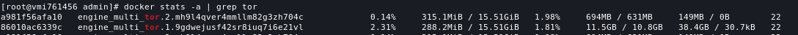
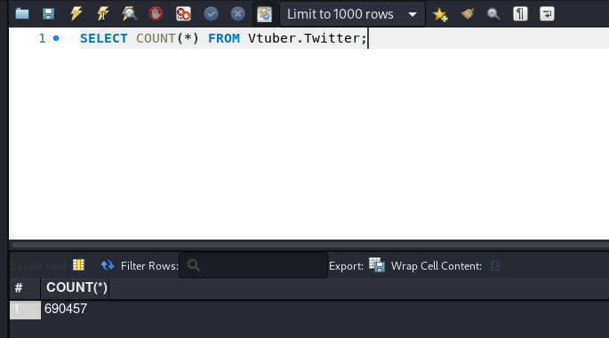

So when i create one of the features of my bot I was stuck for 4 weeks because twitter API have some limitations and that was very annoying for my bot, like when the scrapper got blocked and after a while unblocked my bot will crash because the scrapper send tons of data and my bot can't handle it

If we look at twitter [doc](https://developer.twitter.com/en/docs/twitter-api/rate-limits) the limit is 450/15-minute

Meanwhile, my bot should scrap more than 380+ twitter hashtags per/5-minute

after some googling I found out if I can use [mulittor](https://github.com/trimstray/multitor) for scrap twitter, yeah it solve my problem for 3 months after that I got a new problem [mulittor](https://github.com/trimstray/multitor) was very greedy with resources and that make my server down 

Because of that, I created my own [Go-MultiTor](https://github.com/JustHumanz/Go-MultiTor) the logic flow is kinda same with [mulittor](https://github.com/trimstray/multitor) but my multitor write in golang and no need for any other dependency, just need the tor binary.

Of course i don't just rewrite it, i add more features like add or delete tor circuit, circuit health check, and containerization.  
And the resource was not very heavy like before

Now i already have more than 600000 twit in my database and keep increasing every minute 

the tools :
- [Go-MultiTor](https://github.com/JustHumanz/Go-MultiTor)
- [twitter-scraper](https://github.com/n0madic/twitter-scraper)