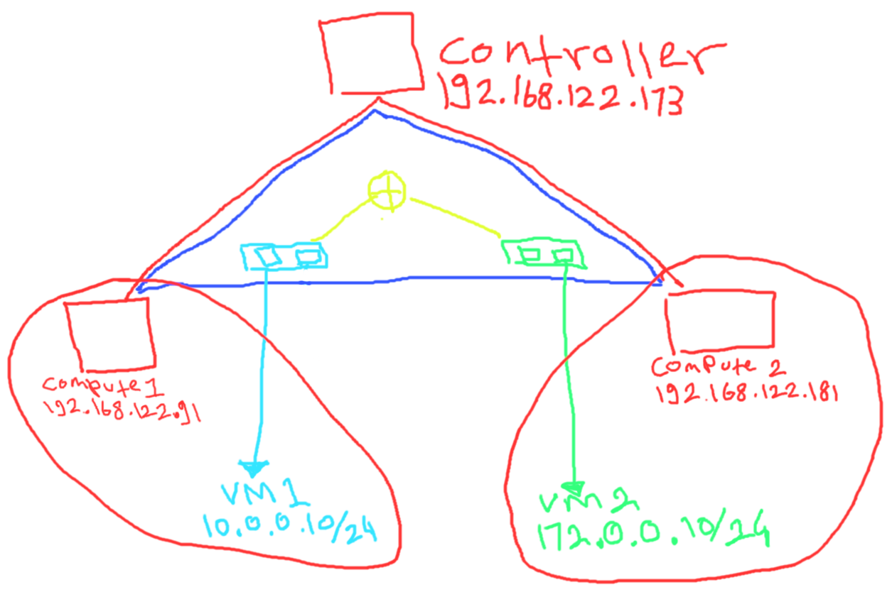

In my last post i'm was trying to connecting two vm with same network but diffrent host,in this post i'm will trying to connecting two vm with diffrent network and diffrent host.

Just like usualy it's will better if i'm make the topology first.


## Topology
- 1 Controller as a gateway
- 1 Logical router
- 2 Logical switch
- 2 Compute 
- 2 Client



red : physical network  
blue : overlay network  
light blue : virtual network 10.0.0.0/24  
light green : virtual network 172.0.0.0/24  
yello : logical router

- Controller : 192.168.122.173
- Compute 1 : 192.168.122.91
- Compute 2 : 192.168.122.181

from this topology my goal is to connection vm1 to vm2, but vm1 and vm2 has diffrent network address and should connected via logical router

## Setup
First let's delete the previous config,

```bash
root@ubuntu-nested-1:~# ovn-nbctl ls-del net-1
root@ubuntu-nested-1:~# ovn-nbctl show
```
Make sure the output was empty

```bash
root@ubuntu-nested-1:~# ovn-nbctl ls-add net-1
root@ubuntu-nested-1:~# ovn-nbctl set logical_switch net-1 other_config:subnet="10.0.0.0/24" other_config:exclude_ips="10.0.0.1"
root@ubuntu-nested-1:~# ovn-nbctl lsp-add net-1 vm1
root@ubuntu-nested-1:~# ovn-nbctl lsp-set-addresses vm1 "00:00:00:00:01:01 10.0.0.10"
```
Create the virtual network net-1

```bash
root@ubuntu-nested-1:~# ovn-nbctl ls-add net-2
root@ubuntu-nested-1:~# ovn-nbctl set logical_switch net-2 other_config:subnet="172.0.0.0/24" other_config:exclude_ips="172.0.0.1"
root@ubuntu-nested-1:~# ovn-nbctl lsp-add net-2 vm2
root@ubuntu-nested-1:~# ovn-nbctl lsp-set-addresses vm2 "00:00:00:00:02:01 172.0.0.10"
```
Do the same with virtual network net-2

```bash
root@ubuntu-nested-1:~# ovn-nbctl show
switch ac828b40-8d5f-4803-8128-ff6c6b9f32ea (net-1)
    port vm1
        addresses: ["00:00:00:00:01:01 10.0.0.10"]
switch 4133f7bc-5327-431d-9612-b177c475fcb8 (net-2)
    port vm2
        addresses: ["00:00:00:00:02:01 172.0.0.10"]
```
Verify the config with show

```bash
root@ubuntu-nested-1:~# ovn-nbctl lr-add router1
```
Now create the logical router

```bash
root@ubuntu-nested-1:~# ovn-nbctl lrp-add router1 router1-net1 00:00:00:00:0f:01 10.0.0.1/24
root@ubuntu-nested-1:~# ovn-nbctl lsp-add net-1 net1-router1
root@ubuntu-nested-1:~# ovn-nbctl lsp-set-addresses net1-router1 00:00:00:00:0f:01
root@ubuntu-nested-1:~# ovn-nbctl lsp-set-type net1-router1 router
root@ubuntu-nested-1:~# ovn-nbctl lsp-set-options net1-router1 router-port=router1-net1
```
In here i'm was trying to connecting switch net-1 to router1

```bash
root@ubuntu-nested-1:~# ovn-nbctl lrp-add router1 router1-net2 00:00:00:00:0f:02 172.0.0.1/24
root@ubuntu-nested-1:~# ovn-nbctl lsp-add net-2 net2-router1
root@ubuntu-nested-1:~# ovn-nbctl lsp-set-addresses net2-router1 00:00:00:00:0f:02
root@ubuntu-nested-1:~# ovn-nbctl lsp-set-type net2-router1 router
root@ubuntu-nested-1:~# ovn-nbctl lsp-set-options net2-router1 router-port=router1-net2
```
Do the same with net-2 to router1

```bash
root@ubuntu-nested-1:~# ovn-nbctl show
switch ac828b40-8d5f-4803-8128-ff6c6b9f32ea (net-1)
    port vm1
        addresses: ["00:00:00:00:01:01 10.0.0.10"]
    port net1-router1
        type: router
        addresses: ["00:00:00:00:0f:01"]
        router-port: router1-net1
switch 4133f7bc-5327-431d-9612-b177c475fcb8 (net-2)
    port net2-router1
        type: router
        addresses: ["00:00:00:00:0f:02"]
        router-port: router1-net2
    port vm2
        addresses: ["00:00:00:00:02:01 172.0.0.10"]
router 1af2601d-ee4f-449c-9bfa-a5bd1c07ed9a (router1)
    port router1-net1
        mac: "00:00:00:00:0f:01"
        networks: ["10.0.0.1/24"]
    port router1-net2
        mac: "00:00:00:00:0f:02"
        networks: ["172.0.0.1/24"]
```
Check the config, as you can see the port net1-router1 was created on both logical switch and logical port that's mean the switch was connected to router

Here was a example illustration :


Now let's continue to create dhcp and create the vm.


```bash
root@ubuntu-nested-1:~# ovn-nbctl create dhcp_options cidr=10.0.0.0/24 options='"lease_time"="3600" "router"="10.0.0.1" "server_id"="10.0.0.1" "server_mac"="00:00:00:00:0f:01"'
c5775a6a-86e3-48a2-b26f-d3b4246c7bba
root@ubuntu-nested-1:~# ovn-nbctl create dhcp_options cidr=172.0.0.0/24 options='"lease_time"="3600" "router"="172.0.0.1" "server_id"="172.0.0.1" "server_mac"="00:00:00:00:0f:02"'
11cc5d7b-cd5e-433f-bd11-634fc92c44c7
root@ubuntu-nested-1:~# ovn-nbctl lsp-set-dhcpv4-options vm1 c5775a6a-86e3-48a2-b26f-d3b4246c7bba
root@ubuntu-nested-1:~# ovn-nbctl lsp-set-dhcpv4-options vm2 11cc5d7b-cd5e-433f-bd11-634fc92c44c7
```
Create dhcp and attach to the port


## Create the client
In compute 1 i'm will set vm1 and vm2 on compute 2.

Compute 1 
```bash
root@ubuntu-nested-2:~# ip link add vm1-peer type veth peer name vm1
root@ubuntu-nested-2:~# ovs-vsctl add-port br-int vm1-peer
root@ubuntu-nested-2:~# ovs-vsctl set interface vm1-peer external_ids:iface-id=vm1
root@ubuntu-nested-2:~# ip link set vm1-peer up
root@ubuntu-nested-2:~# ip netns add vm1-ns
root@ubuntu-nested-2:~# ip link set vm1 netns vm1-ns
root@ubuntu-nested-2:~# ip netns exec vm1-ns ip link set dev vm1 address 00:00:00:00:01:01
root@ubuntu-nested-2:~# ip netns exec vm1-ns ip link set vm1 up
root@ubuntu-nested-2:~# ip netns exec vm1-ns dhclient
root@ubuntu-nested-2:~# ip netns exec vm1-ns ip a
1: lo: <LOOPBACK> mtu 65536 qdisc noop state DOWN group default qlen 1000
    link/loopback 00:00:00:00:00:00 brd 00:00:00:00:00:00
18: vm1@if19: <BROADCAST,MULTICAST,UP,LOWER_UP> mtu 1500 qdisc noqueue state UP group default qlen 1000
    link/ether 00:00:00:00:01:01 brd ff:ff:ff:ff:ff:ff link-netnsid 0
    inet 10.0.0.10/24 brd 10.0.0.255 scope global vm1
       valid_lft forever preferred_lft forever
    inet6 fe80::200:ff:fe00:101/64 scope link tentative 
       valid_lft forever preferred_lft forever
```
Make sure the mac address was same

Compute 2
```bash
root@ubuntu-nested-3:~# ip link add vm2-peer type veth peer name vm2
root@ubuntu-nested-3:~# ovs-vsctl add-port br-int vm2-peer
root@ubuntu-nested-3:~# ovs-vsctl set interface vm2-peer external_ids:iface-id=vm2
root@ubuntu-nested-3:~# ip link set vm2-peer up
root@ubuntu-nested-3:~# ip netns add vm2-ns
root@ubuntu-nested-3:~# ip link set vm2 netns vm2-ns
root@ubuntu-nested-3:~# ip netns exec vm2-ns ip link set dev vm2 address 00:00:00:00:02:01
root@ubuntu-nested-3:~# ip netns exec vm2-ns ip link set vm2 up
root@ubuntu-nested-3:~# ip netns exec vm2-ns dhclient
root@ubuntu-nested-3:~# ip netns exec vm2-ns ip a
1: lo: <LOOPBACK> mtu 65536 qdisc noop state DOWN group default qlen 1000
    link/loopback 00:00:00:00:00:00 brd 00:00:00:00:00:00
19: vm2@if20: <BROADCAST,MULTICAST,UP,LOWER_UP> mtu 1500 qdisc noqueue state UP group default qlen 1000
    link/ether 00:00:00:00:02:01 brd ff:ff:ff:ff:ff:ff link-netnsid 0
    inet 172.0.0.10/24 brd 172.0.0.255 scope global vm2
       valid_lft forever preferred_lft forever
    inet6 fe80::200:ff:fe00:201/64 scope link 
       valid_lft forever preferred_lft forever
```

## Test
On compute 1
```bash
root@ubuntu-nested-2:~# ip netns exec vm1-ns ip a
1: lo: <LOOPBACK> mtu 65536 qdisc noop state DOWN group default qlen 1000
    link/loopback 00:00:00:00:00:00 brd 00:00:00:00:00:00
18: vm1@if19: <BROADCAST,MULTICAST,UP,LOWER_UP> mtu 1500 qdisc noqueue state UP group default qlen 1000
    link/ether 00:00:00:00:01:01 brd ff:ff:ff:ff:ff:ff link-netnsid 0
    inet 10.0.0.10/24 brd 10.0.0.255 scope global vm1
       valid_lft forever preferred_lft forever
    inet6 fe80::200:ff:fe00:101/64 scope link 
       valid_lft forever preferred_lft forever
root@ubuntu-nested-2:~# ip netns exec vm1-ns ping -c 3 172.0.0.10
PING 172.0.0.10 (172.0.0.10) 56(84) bytes of data.
64 bytes from 172.0.0.10: icmp_seq=1 ttl=63 time=1.07 ms
64 bytes from 172.0.0.10: icmp_seq=2 ttl=63 time=0.321 ms
64 bytes from 172.0.0.10: icmp_seq=3 ttl=63 time=0.303 ms

--- 172.0.0.10 ping statistics ---
3 packets transmitted, 3 received, 0% packet loss, time 2011ms
rtt min/avg/max/mdev = 0.303/0.565/1.072/0.358 ms
```

On compute 2
```bash
root@ubuntu-nested-3:~# ip netns exec vm2-ns ip a
1: lo: <LOOPBACK> mtu 65536 qdisc noop state DOWN group default qlen 1000
    link/loopback 00:00:00:00:00:00 brd 00:00:00:00:00:00
19: vm2@if20: <BROADCAST,MULTICAST,UP,LOWER_UP> mtu 1500 qdisc noqueue state UP group default qlen 1000
    link/ether 00:00:00:00:02:01 brd ff:ff:ff:ff:ff:ff link-netnsid 0
    inet 172.0.0.10/24 brd 172.0.0.255 scope global vm2
       valid_lft forever preferred_lft forever
    inet6 fe80::200:ff:fe00:201/64 scope link 
       valid_lft forever preferred_lft forever
root@ubuntu-nested-3:~# ip netns exec vm2-ns ping -c 3 10.0.0.10
PING 10.0.0.10 (10.0.0.10) 56(84) bytes of data.
64 bytes from 10.0.0.10: icmp_seq=1 ttl=63 time=0.280 ms
64 bytes from 10.0.0.10: icmp_seq=2 ttl=63 time=0.386 ms
64 bytes from 10.0.0.10: icmp_seq=3 ttl=63 time=0.284 ms

--- 10.0.0.10 ping statistics ---
3 packets transmitted, 3 received, 0% packet loss, time 2039ms
rtt min/avg/max/mdev = 0.280/0.316/0.386/0.053 ms
```

All vm can do ping each other even the client was hosted in different host/compute and have diffrent network.

Now the question is,where the logical router was hosted? is on compute1 or compute2 or controller ?


for now let end in here,in next post i will try to add snat&dnat(floating ip).
