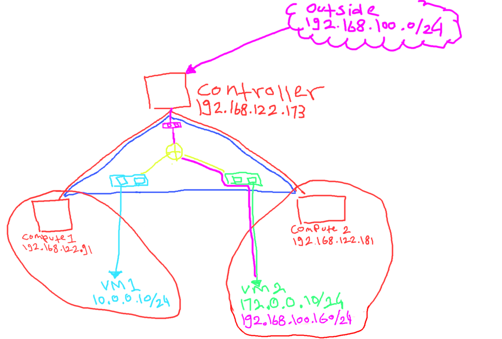

In this last post i will explain to create the snat&dnat or a.k.a floating ip,just like previous post let create the topology fist

## Topology
- 1 Controller as a gateway
- 1 Logical router
- 3 Logical switch
- 2 Compute 
- 2 Client



red : physical network  
blue : overlay network  
light blue : virtual network 10.0.0.0/24  
light green : virtual network 172.0.0.0/24  
purple : floating ip network 192.168.100.0/24  
yello : logical router

- Controller : 192.168.122.173
- Compute 1 : 192.168.122.91
- Compute 2 : 192.168.122.181
- vm2 : 192.168.100.160

## Setup
Because the topology was same like part 2 so in here i'm just add steps to add fip

```bash
root@ubuntu-nested-1:~# ovs-vsctl set open_vswitch . external-ids:ovn-bridge-mappings=phyNet:br-ex
root@ubuntu-nested-1:~# ovs-vsctl add-br br-ex
root@ubuntu-nested-1:~# ovs-vsctl add-port br-ex enp7s0
root@ubuntu-nested-1:~# ifconfig enp7s0 up
```
Fist is set the bridge mapping for the outside,in here i'm use br-ex and the interface to connect with outside is enp7s0

```bash
root@ubuntu-nested-1:~# ovn-nbctl ls-add public
root@ubuntu-nested-1:~# ovn-nbctl lsp-add public ln-public
root@ubuntu-nested-1:~# ovn-nbctl lsp-set-type ln-public localnet
root@ubuntu-nested-1:~# ovn-nbctl lsp-set-addresses ln-public unknown
root@ubuntu-nested-1:~# ovn-nbctl lsp-set-options ln-public network_name=phyNet
```
After that create the logical switch for floating ip network,in here i was set the in-public port to address `unknown` and the network_name `phyNet`

```bash
root@ubuntu-nested-1:~# ovn-nbctl lrp-add router1 router1-public 00:00:00:00:00:fe 192.168.100.254/24
root@ubuntu-nested-1:~# ovn-nbctl lsp-add public public-router1
root@ubuntu-nested-1:~# ovn-nbctl lsp-set-type public-router1 router
root@ubuntu-nested-1:~# ovn-nbctl lsp-set-addresses public-router1 router
root@ubuntu-nested-1:~# ovn-nbctl lsp-set-options public-router1 router-port=router1-public
```
Now connecting the floating ip network to router1

```bash
root@ubuntu-nested-1:~# ovn-nbctl lrp-set-gateway-chassis router1-public host1 20
root@ubuntu-nested-1:~# ovn-sbctl show
Chassis host3
    hostname: ubuntu-nested-3
    Encap geneve
        ip: "192.168.122.181"
        options: {csum="true"}
    Port_Binding vm2
Chassis host1
    hostname: ubuntu-nested-1
    Encap geneve
        ip: "192.168.122.173"
        options: {csum="true"}
    Port_Binding cr-router1-public
Chassis host2
    hostname: ubuntu-nested-2
    Encap geneve
        ip: "192.168.122.91"
        options: {csum="true"}
    Port_Binding vm1
```
After the fip network was connected with router1 it's time to bind the port who connecting fip network to router into controller 1 as a gateway

```bash
root@ubuntu-nested-1:~# ovn-nbctl lr-nat-add router1 dnat_and_snat 192.168.100.160 172.0.0.10
```
the last is add the dnat&snat to ip vm2

```bash
╭─[403] as humanz in /mnt/Data/justhumanz.github.io on (master)
╰─(ﾉ˚Д˚)ﾉ ifconfig virbr1    
virbr1: flags=4163<UP,BROADCAST,RUNNING,MULTICAST>  mtu 1500
        inet 192.168.100.1  netmask 255.255.255.0  broadcast 192.168.100.255
        ether 52:54:00:75:b7:ae  txqueuelen 1000  (Ethernet)
        RX packets 79  bytes 6314 (6.1 KiB)
        RX errors 0  dropped 0  overruns 0  frame 0
        TX packets 378  bytes 70598 (68.9 KiB)
        TX errors 0  dropped 0 overruns 0  carrier 0  collisions 0


╭─[403] as humanz in /mnt/Data/justhumanz.github.io on (master)
╰─(ﾉ˚Д˚)ﾉ ping -c 3 192.168.100.160
PING 192.168.100.160 (192.168.100.160) 56(84) bytes of data.
64 bytes from 192.168.100.160: icmp_seq=1 ttl=63 time=1.14 ms
64 bytes from 192.168.100.160: icmp_seq=2 ttl=63 time=0.340 ms
64 bytes from 192.168.100.160: icmp_seq=3 ttl=63 time=0.310 ms

--- 192.168.100.160 ping statistics ---
3 packets transmitted, 3 received, 0% packet loss, time 2013ms
rtt min/avg/max/mdev = 0.310/0.597/1.143/0.385 ms
```

As you can see,my laptop can reach the vm2 ip address

```bash
root@ubuntu-nested-3:~# ip netns exec vm2-ns ping -c 2 192.168.100.1
PING 192.168.100.1 (192.168.100.1) 56(84) bytes of data.
64 bytes from 192.168.100.1: icmp_seq=1 ttl=63 time=0.306 ms
64 bytes from 192.168.100.1: icmp_seq=2 ttl=63 time=0.404 ms

--- 192.168.100.1 ping statistics ---
2 packets transmitted, 2 received, 0% packet loss, time 1023ms
rtt min/avg/max/mdev = 0.306/0.355/0.404/0.049 ms
root@ubuntu-nested-3:~# ip netns exec vm2-ns nc -v 192.168.100.1 8118
Connection to 192.168.100.1 8118 port [tcp/*] succeeded!

──────────────────────────────────────────────────────────────────────────────────────────────────────────────

╭─[403] as humanz in ~
╰──➤ nc -lp 8118                   
```

from vm2 to my laptop also fine.


all steps from part 1 until part 3 already on [my github](https://github.com/JustHumanz/OpenvSwitch-dojo),if you have some question you can open a issues 