## Note
better if you see my [ceph architecture](https://github.com/JustHumanz/Ceph-dojo) first

finally i have some free time to write this post, what a rough years.

anyway this time i will post **how to recovery ceph image directly from osds** the reason why i write / think about this post was because ~~my fvcking cluster was got removed~~ we have some accident in our prod cluster and that accident make our ceph-mon was gone,gladly we can recovery ceph-mon from this [article](https://cloud.garr.it/support/kb/ceph/restore-ceph-from-mon-disaster/) buttt what if the ceph-mon was never come back or we failed to bring back the ceph mon?

after the accident i was thingking, if we can bring back the ceph-mon from osds can we recovery the ceph image directly from osds ? and from that my research was started.

## Experiment 0x0
i create a simple ceph image (with ext4 filesystem) then dump the object (through rbd) after that concat all object into one file

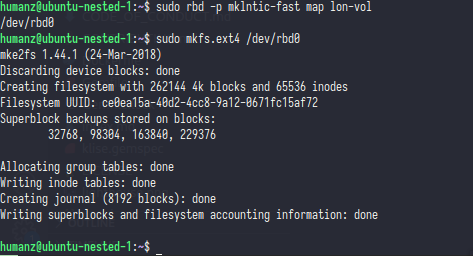     

now let's mount and fill the image

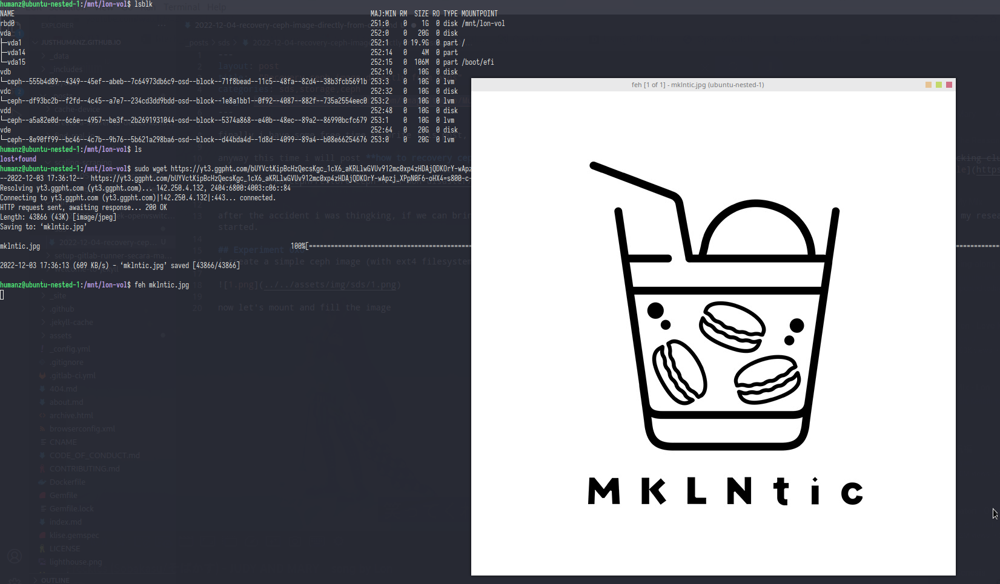     

and the last,let's try dump the object & concat all object into one file

     

the result was ........

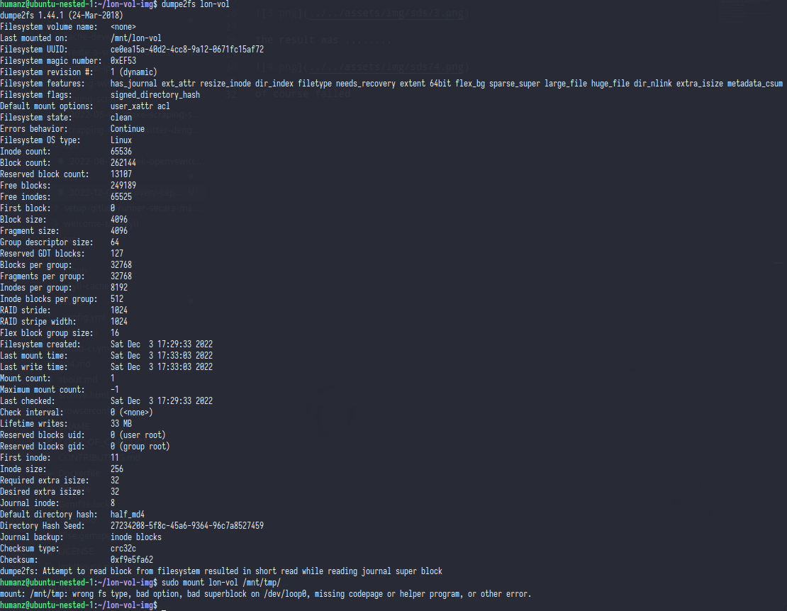     

of course failed

>but whats is worng with this step? is when i do get object from ceph or when concating all file into one?

honesty i'm stuck at this step for 1-2 weeks, i'm already review the [ceph export](https://github.com/ceph/ceph/blob/octopus/src/tools/rbd/action/Export.cc) code but still no luck,until i found same question in [stackexchange](https://unix.stackexchange.com/questions/331968/recover-vm-images-from-dead-ceph-cluster)

sadly his repo was already gone 

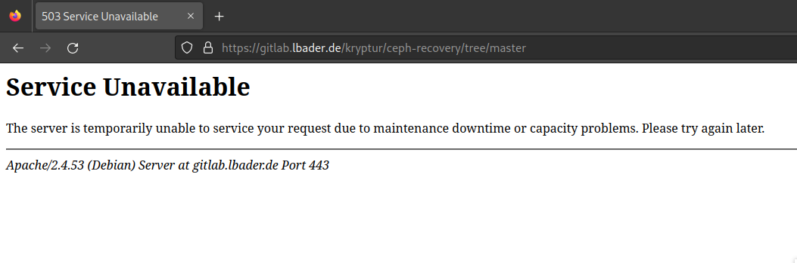     

at least he explain why you cannot concating all object into one file

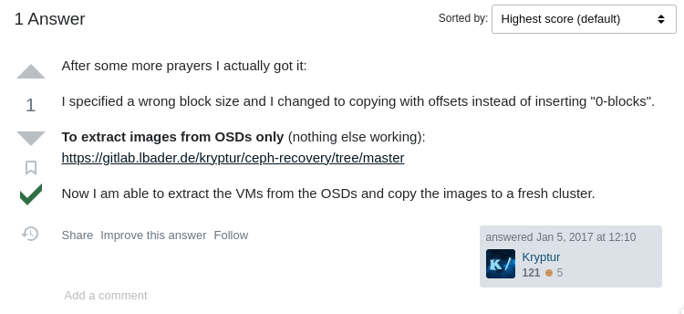     

still at this time i'm not very clear what the meaning of that answer 

## Experiment 0x1
after first experiment was fail i'm keep trying to search info for recovery ceph image after a while i found [blog](https://ceph.io/en/news/blog/2015/ceph-recover-a-rbd-image-from-a-dead-cluster/) from ceph it's self but the blog was unable to read due to messy format but i'm still lucky from that blog i found some [script](https://github.com/smmoore/ceph/blob/master/rbd_restore.sh) to how concating all object into image *you can't run this script on latest ceph version,this script only for filestore which is the lod ceph) that's why i need to modify it*

now let's review the script

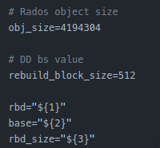     

the first things is you should know the default object size (the default was 4MB) and then the image size, for the rebuild_block_size i will explain it later

    

red : create the ceph image with `seek` same as ceph image size 

green : get the object number (object number usally like this `rbd_data.xxx.000hex` and you need to filter it)

white : the formula, so here the formula object size will multiple by object name after that will divide with rebuild_block_size

> but where you found the rebuild_block_size? is persistent value?

[512 was value from sector sizes](https://wiki.archlinux.org/title/Advanced_Format),512 was the default size 

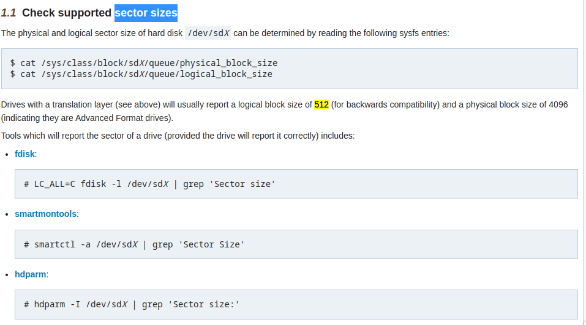    

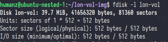    

so that all was clear and like [kryptur](https://unix.stackexchange.com/users/206630/kryptur) say i was worng in **block size**

## Experiment 0x2
now let's start with new script

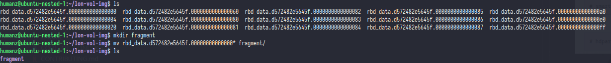    

first i create new dir & move all objet into that dir

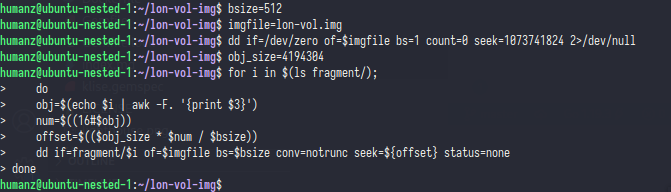    

then i run the script where i already modify 

and the result was .....

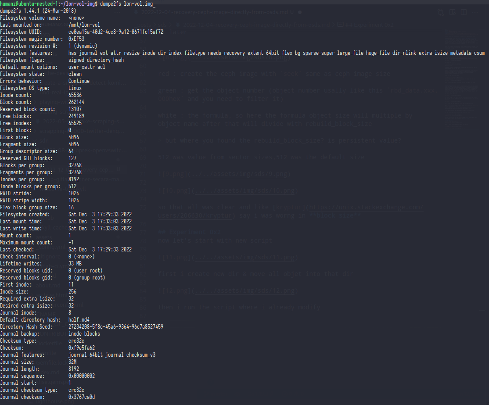    

the filesystem can be read and all files was available

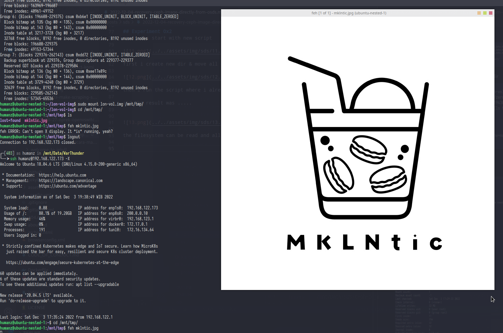    

and yesssss we i can concat ceph object it into file system with correct way, but only that? i think we missing something

## Experiment 0x3
yes,i'm exporting the object was through rbd not from osds so in this and last experiment i will show you how to export ceph object directly from osds

from ceph doc it self you can use [ceph-objectstore-tool](https://docs.ceph.com/en/pacific/man/8/ceph-objectstore-tool/) to CRUD object inside the osds

before use that tools make sure if you osds was in down/off state

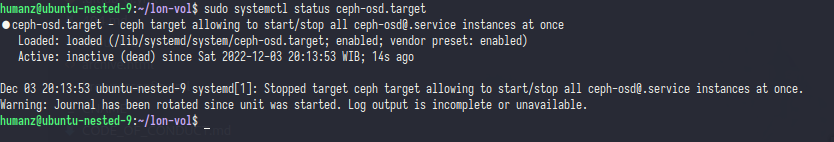    

first you need to find the ceph image header

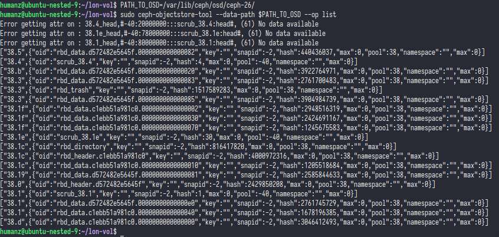    

if you already get it cek the omap(object map) list

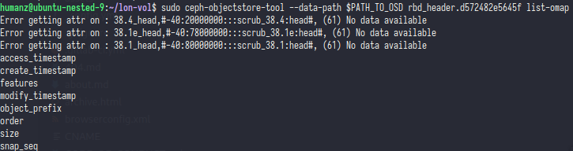    

as you can see the list was same like `rbd info` from here you need take the size 

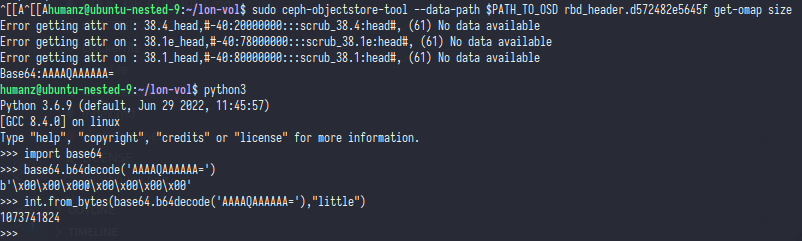    

when you get the value of size you need to decode it,use python will be ezpz

>OK now i'm already get the value of size,what next?

ofc dumping all object from all osds

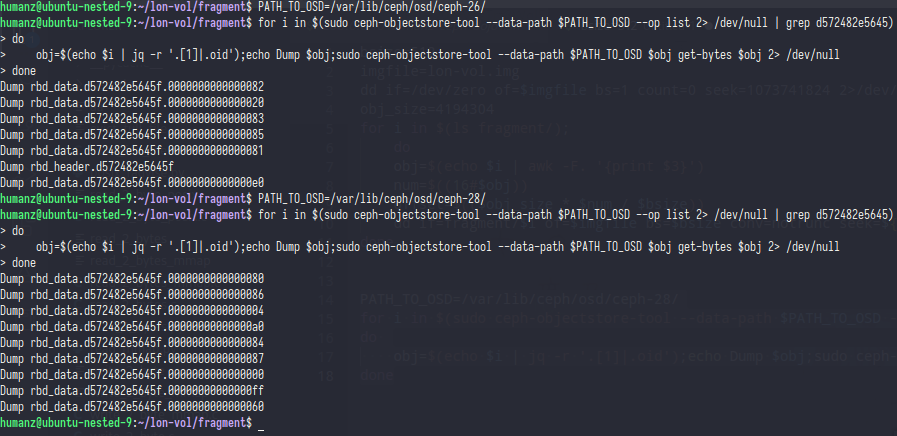    

*i dump it twice because i only have two osds in this host&rack*

same like before you need to concat all object into one file system

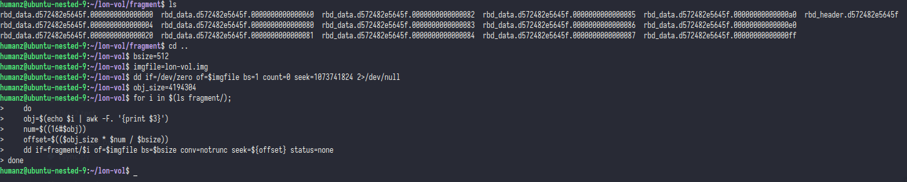    

and the result was ...

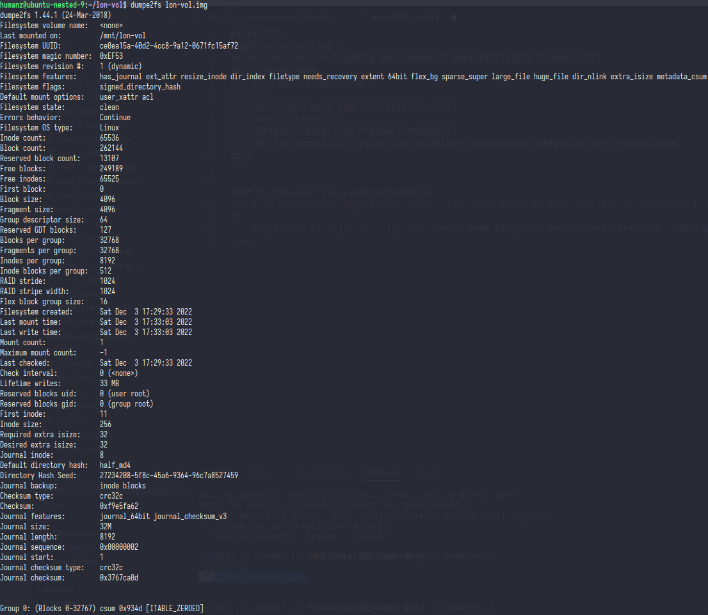    

open it with feh

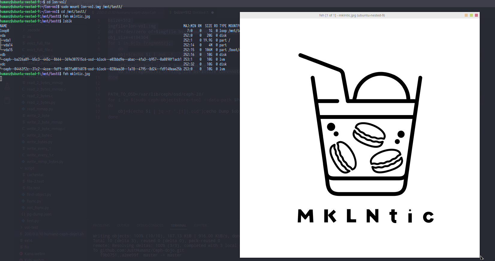    

-----------------------------------------------------------------
so i think that's all,hope you understand the point. 

thx 

refrence :
- https://cloud.garr.it/support/kb/ceph/restore-ceph-from-mon-disaster/
- https://unix.stackexchange.com/questions/331968/recover-vm-images-from-dead-ceph-cluster
- https://ceph.io/en/news/blog/2015/ceph-recover-a-rbd-image-from-a-dead-cluster/
- https://github.com/smmoore/ceph/blob/master/rbd_restore.sh
- https://wiki.archlinux.org/title/Advanced_Format

special thx to [@kryptur](https://unix.stackexchange.com/users/206630/kryptur) and [@smmoore](https://github.com/smmoore)
